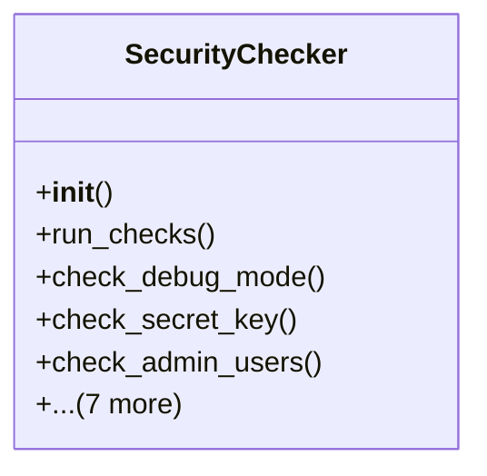

# admin_modules.internal_diagnosis_module.components.security_checker

## Imports
- django.conf
- django.contrib.auth.models
- django.db.models
- django.utils
- models
- os
- pkg_resources
- re
- socket
- ssl
- subprocess

## Classes
- SecurityChecker
  - method: `__init__`
  - method: `run_checks`
  - method: `check_debug_mode`
  - method: `check_secret_key`
  - method: `check_admin_users`
  - method: `check_ssl_configuration`
  - method: `check_allowed_hosts`
  - method: `check_installed_packages`
  - method: `check_file_permissions`
  - method: `check_cors_settings`
  - method: `check_csrf_protection`
  - method: `_create_result`

## Functions
- __init__
- run_checks
- check_debug_mode
- check_secret_key
- check_admin_users
- check_ssl_configuration
- check_allowed_hosts
- check_installed_packages
- check_file_permissions
- check_cors_settings
- check_csrf_protection
- _create_result

## Class Diagram

