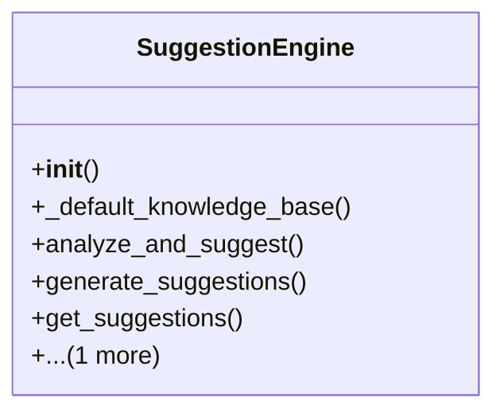

# admin_modules.internal_diagnosis_module.components.suggestion_engine

## Imports
- datetime

## Classes
- SuggestionEngine
  - method: `__init__`
  - method: `_default_knowledge_base`
  - method: `analyze_and_suggest`
  - method: `generate_suggestions`
  - method: `get_suggestions`
  - method: `clear_suggestions`

## Functions
- __init__
- _default_knowledge_base
- analyze_and_suggest
- generate_suggestions
- get_suggestions
- clear_suggestions

## Class Diagram

