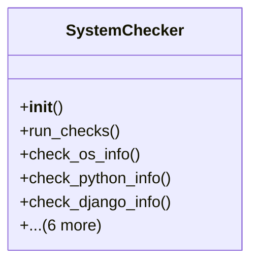

# admin_modules.internal_diagnosis_module.components.system_checker

## Imports
- django
- django.conf
- django.utils
- models
- os
- platform
- psutil
- socket

## Classes
- SystemChecker
  - method: `__init__`
  - method: `run_checks`
  - method: `check_os_info`
  - method: `check_python_info`
  - method: `check_django_info`
  - method: `check_disk_usage`
  - method: `check_memory_usage`
  - method: `check_cpu_usage`
  - method: `check_network_connectivity`
  - method: `check_required_directories`
  - method: `_create_result`

## Functions
- __init__
- run_checks
- check_os_info
- check_python_info
- check_django_info
- check_disk_usage
- check_memory_usage
- check_cpu_usage
- check_network_connectivity
- check_required_directories
- _create_result

## Class Diagram

