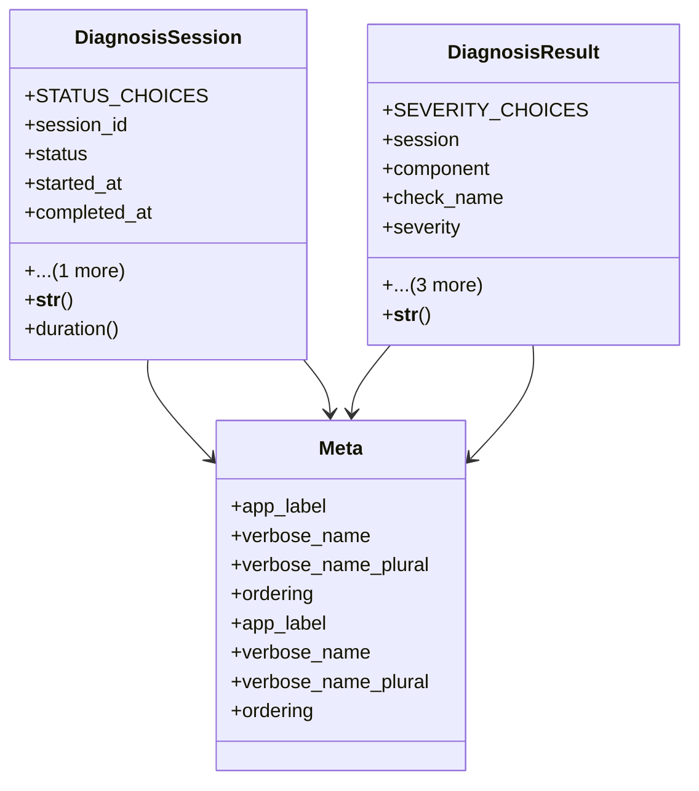

# admin_modules.internal_diagnosis_module.models

## Imports
- django.conf
- django.db
- django.utils
- django.utils.translation

## Classes
- DiagnosisSession
  - attr: `STATUS_CHOICES`
  - attr: `session_id`
  - attr: `status`
  - attr: `started_at`
  - attr: `completed_at`
  - attr: `initiated_by`
  - method: `__str__`
  - method: `duration`
- DiagnosisResult
  - attr: `SEVERITY_CHOICES`
  - attr: `session`
  - attr: `component`
  - attr: `check_name`
  - attr: `severity`
  - attr: `message`
  - attr: `details`
  - attr: `timestamp`
  - method: `__str__`
- Meta
  - attr: `app_label`
  - attr: `verbose_name`
  - attr: `verbose_name_plural`
  - attr: `ordering`
- Meta
  - attr: `app_label`
  - attr: `verbose_name`
  - attr: `verbose_name_plural`
  - attr: `ordering`

## Functions
- __str__
- duration
- __str__

## Class Diagram

