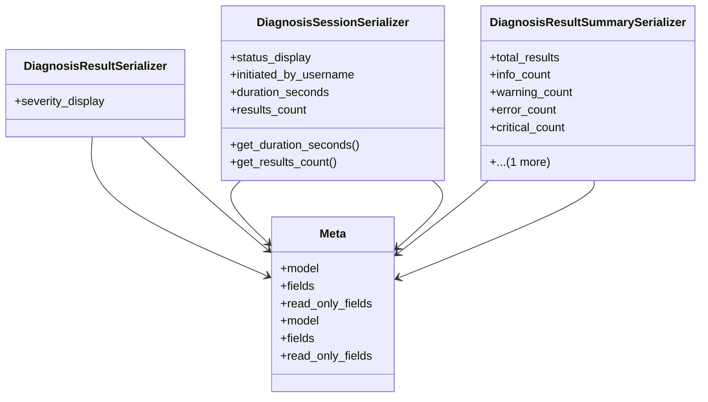

# admin_modules.internal_diagnosis_module.serializers

## Imports
- models
- rest_framework

## Classes
- DiagnosisResultSerializer
  - attr: `severity_display`
- DiagnosisSessionSerializer
  - attr: `status_display`
  - attr: `initiated_by_username`
  - attr: `duration_seconds`
  - attr: `results_count`
  - method: `get_duration_seconds`
  - method: `get_results_count`
- DiagnosisResultSummarySerializer
  - attr: `total_results`
  - attr: `info_count`
  - attr: `warning_count`
  - attr: `error_count`
  - attr: `critical_count`
  - attr: `components`
- Meta
  - attr: `model`
  - attr: `fields`
  - attr: `read_only_fields`
- Meta
  - attr: `model`
  - attr: `fields`
  - attr: `read_only_fields`

## Functions
- get_duration_seconds
- get_results_count

## Class Diagram

