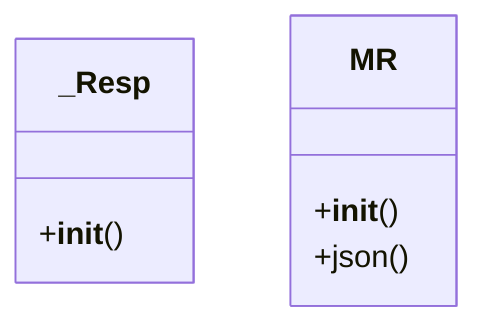

# admin_modules.internal_diagnosis_module.testing.run_component_tests_clean

## Imports
- alerting_system
- data_integrity_checker
- datetime
- error_detection_logging_engine
- io
- json
- module_integration_verifier
- os
- performance_monitor
- reporting_engine
- requests
- suggestion_engine
- sys
- time

## Classes
- _Resp
  - method: `__init__`
- MR
  - method: `__init__`
  - method: `json`

## Functions
- print_test_result
- mock_execute_query
- mock_execute_query_ok
- mock_get
- _mock_exec
- mock_get_ver
- __init__
- __init__
- json

## Module Variables
- `BASE_DIR`
- `COMPONENTS_PATH`
- `component_name`
- `component_name`
- `component_name`
- `component_name`
- `dummy_log_path_errors`
- `dummy_log_path_no_errors`
- `dummy_log_path_missing`
- `component_name`
- `component_name`
- `component_name`

## Class Diagram

