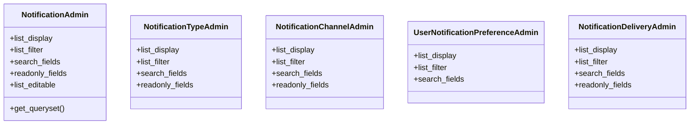

# admin_modules.notifications.admin

## Imports
- django.contrib
- models

## Classes
- NotificationAdmin
  - attr: `list_display`
  - attr: `list_filter`
  - attr: `search_fields`
  - attr: `readonly_fields`
  - attr: `list_editable`
  - method: `get_queryset`
- NotificationTypeAdmin
  - attr: `list_display`
  - attr: `list_filter`
  - attr: `search_fields`
  - attr: `readonly_fields`
- NotificationChannelAdmin
  - attr: `list_display`
  - attr: `list_filter`
  - attr: `search_fields`
  - attr: `readonly_fields`
- UserNotificationPreferenceAdmin
  - attr: `list_display`
  - attr: `list_filter`
  - attr: `search_fields`
- NotificationDeliveryAdmin
  - attr: `list_display`
  - attr: `list_filter`
  - attr: `search_fields`
  - attr: `readonly_fields`

## Functions
- get_queryset

## Class Diagram

