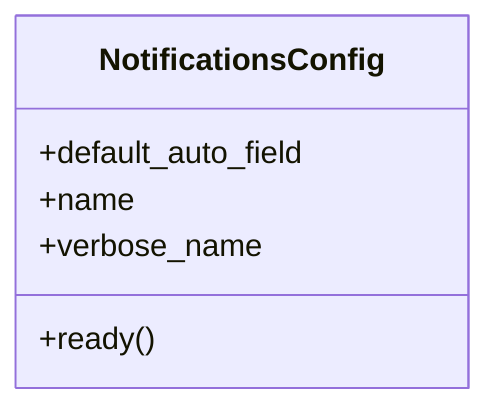

# admin_modules.notifications.apps

## Imports
- django.apps
- django.utils.translation

## Classes
- NotificationsConfig
  - attr: `default_auto_field`
  - attr: `name`
  - attr: `verbose_name`
  - method: `ready`

## Functions
- ready

## Class Diagram

