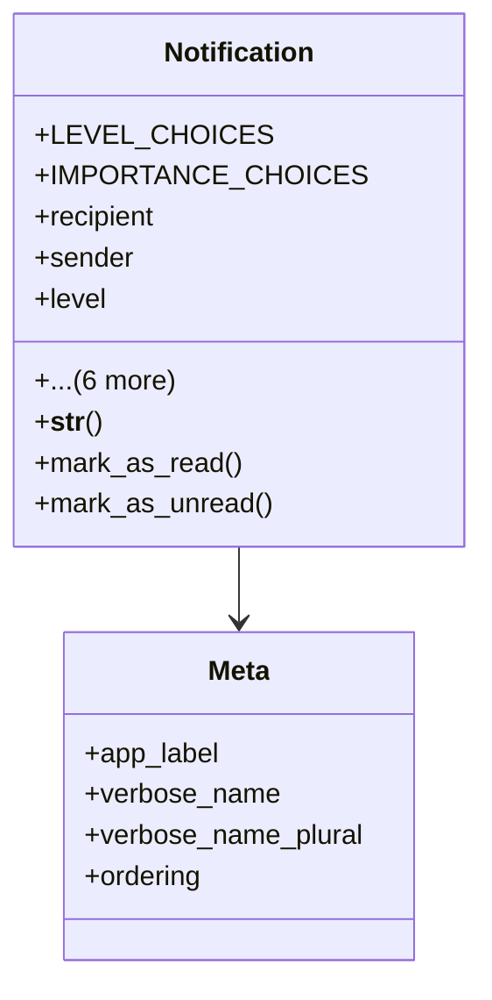

# admin_modules.notifications.backup_files.models

## Imports
- django.conf
- django.db
- django.utils.translation

## Classes
- Notification
  - attr: `LEVEL_CHOICES`
  - attr: `IMPORTANCE_CHOICES`
  - attr: `recipient`
  - attr: `sender`
  - attr: `level`
  - attr: `importance`
  - attr: `title`
  - attr: `message`
  - attr: `read`
  - attr: `created_at`
  - attr: `is_converted_to_task`
  - method: `__str__`
  - method: `mark_as_read`
  - method: `mark_as_unread`
- Meta
  - attr: `app_label`
  - attr: `verbose_name`
  - attr: `verbose_name_plural`
  - attr: `ordering`

## Functions
- __str__
- mark_as_read
- mark_as_unread

## Class Diagram

