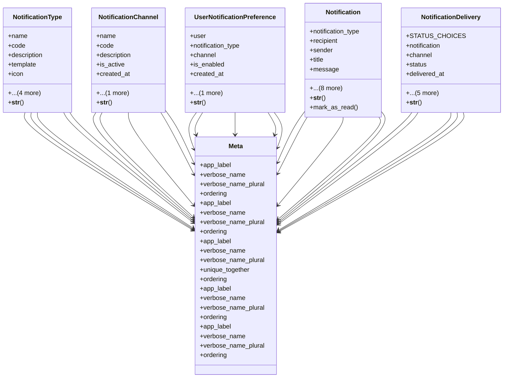

# admin_modules.notifications.models.notification

## Imports
- django.contrib.auth
- django.contrib.contenttypes.fields
- django.contrib.contenttypes.models
- django.db
- django.utils
- django.utils.translation

## Classes
- NotificationType
  - attr: `name`
  - attr: `code`
  - attr: `description`
  - attr: `template`
  - attr: `icon`
  - attr: `color`
  - attr: `is_active`
  - attr: `created_at`
  - attr: `updated_at`
  - method: `__str__`
- NotificationChannel
  - attr: `name`
  - attr: `code`
  - attr: `description`
  - attr: `is_active`
  - attr: `created_at`
  - attr: `updated_at`
  - method: `__str__`
- UserNotificationPreference
  - attr: `user`
  - attr: `notification_type`
  - attr: `channel`
  - attr: `is_enabled`
  - attr: `created_at`
  - attr: `updated_at`
  - method: `__str__`
- Notification
  - attr: `notification_type`
  - attr: `recipient`
  - attr: `sender`
  - attr: `title`
  - attr: `message`
  - attr: `data`
  - attr: `is_read`
  - attr: `read_at`
  - attr: `content_type`
  - attr: `object_id`
  - attr: `content_object`
  - attr: `url`
  - attr: `created_at`
  - method: `__str__`
  - method: `mark_as_read`
- NotificationDelivery
  - attr: `STATUS_CHOICES`
  - attr: `notification`
  - attr: `channel`
  - attr: `status`
  - attr: `delivered_at`
  - attr: `error_message`
  - attr: `retry_count`
  - attr: `external_id`
  - attr: `created_at`
  - attr: `updated_at`
  - method: `__str__`
- Meta
  - attr: `app_label`
  - attr: `verbose_name`
  - attr: `verbose_name_plural`
  - attr: `ordering`
- Meta
  - attr: `app_label`
  - attr: `verbose_name`
  - attr: `verbose_name_plural`
  - attr: `ordering`
- Meta
  - attr: `app_label`
  - attr: `verbose_name`
  - attr: `verbose_name_plural`
  - attr: `unique_together`
  - attr: `ordering`
- Meta
  - attr: `app_label`
  - attr: `verbose_name`
  - attr: `verbose_name_plural`
  - attr: `ordering`
- Meta
  - attr: `app_label`
  - attr: `verbose_name`
  - attr: `verbose_name_plural`
  - attr: `ordering`

## Functions
- __str__
- __str__
- __str__
- __str__
- mark_as_read
- __str__

## Module Variables
- `User`

## Class Diagram

