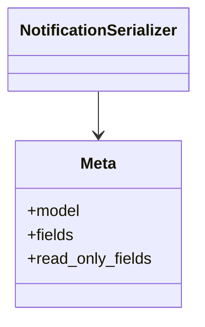

# admin_modules.notifications.serializers

## Imports
- django.contrib.auth
- models
- rest_framework

## Classes
- NotificationSerializer
- Meta
  - attr: `model`
  - attr: `fields`
  - attr: `read_only_fields`

## Module Variables
- `User`

## Class Diagram

