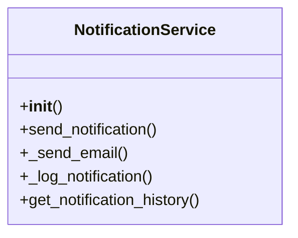

# admin_modules.notifications.services.backup_files.notification_service

## Imports
- django.conf
- django.core.mail
- django.template.loader
- django.utils
- django.utils.translation

## Classes
- NotificationService
  - method: `__init__`
  - method: `send_notification`
  - method: `_send_email`
  - method: `_log_notification`
  - method: `get_notification_history`

## Functions
- _load_notification_settings
- __init__
- send_notification
- _send_email
- _log_notification
- get_notification_history

## Class Diagram

