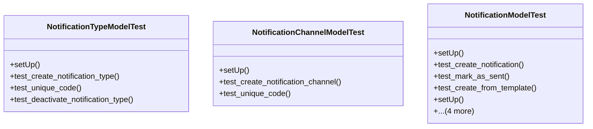

# admin_modules.notifications.tests.test_notifications

## Imports
- core_modules.core.models
- datetime
- django.contrib.auth
- django.core.exceptions
- django.db
- django.test
- django.utils
- models

## Classes
- NotificationTypeModelTest
  - method: `setUp`
  - method: `test_create_notification_type`
  - method: `test_unique_code`
  - method: `test_deactivate_notification_type`
- NotificationChannelModelTest
  - method: `setUp`
  - method: `test_create_notification_channel`
  - method: `test_unique_code`
- NotificationModelTest
  - method: `setUp`
  - method: `test_create_notification`
  - method: `test_mark_as_sent`
  - method: `test_create_from_template`
  - method: `setUp`
  - method: `test_create_notification_preference`
  - method: `test_unique_user_type_channel_per_company`
  - method: `test_toggle_preference`
  - method: `test_get_user_preferences`

## Functions
- setUp
- test_create_notification_type
- test_unique_code
- test_deactivate_notification_type
- setUp
- test_create_notification_channel
- test_unique_code
- setUp
- test_create_notification
- test_mark_as_sent
- test_create_from_template
- setUp
- test_create_notification_preference
- test_unique_user_type_channel_per_company
- test_toggle_preference
- test_get_user_preferences
- mock_mark_as_sent
- mock_create_from_template
- mock_toggle
- mock_get_user_preferences

## Module Variables
- `User`

## Class Diagram

