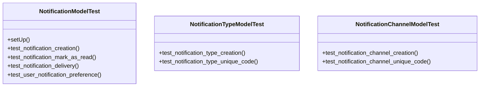

# admin_modules.notifications.tests.test_simple_notifications

## Imports
- django.contrib.auth
- django.test
- django.utils
- models

## Classes
- NotificationModelTest
  - method: `setUp`
  - method: `test_notification_creation`
  - method: `test_notification_mark_as_read`
  - method: `test_notification_delivery`
  - method: `test_user_notification_preference`
- NotificationTypeModelTest
  - method: `test_notification_type_creation`
  - method: `test_notification_type_unique_code`
- NotificationChannelModelTest
  - method: `test_notification_channel_creation`
  - method: `test_notification_channel_unique_code`

## Functions
- setUp
- test_notification_creation
- test_notification_mark_as_read
- test_notification_delivery
- test_user_notification_preference
- test_notification_type_creation
- test_notification_type_unique_code
- test_notification_channel_creation
- test_notification_channel_unique_code

## Module Variables
- `User`

## Class Diagram

