# admin_modules.performance_management.serializers

## Imports
- admin_modules.system_monitoring.models_improved
- integration_modules.ai_monitoring.models
- models
- rest_framework

## Classes
- KeyPerformanceIndicatorSerializer
  - attr: `responsible_user_username`
- KpiRecordSerializer
  - attr: `kpi_name`
  - attr: `recorded_by_username`
- PerformanceGoalSerializer
  - attr: `user_name`
  - attr: `created_by_name`
  - attr: `kpi_names`
  - method: `get_kpi_names`
- PerformanceReviewSerializer
  - attr: `user_name`
  - attr: `reviewer_name`
  - attr: `goal_titles`
  - method: `get_goal_titles`
- PerformanceMetricSerializer
- AIAgentMetricSerializer
- ModuleStatusSerializer
  - attr: `status_display`
- AIModelPerformanceReportSerializer
  - attr: `model_name`
- AlertSerializer
  - attr: `acknowledged_by_username`
- Meta
  - attr: `model`
  - attr: `fields`
  - attr: `read_only_fields`
- Meta
  - attr: `model`
  - attr: `fields`
  - attr: `read_only_fields`
- Meta
  - attr: `model`
  - attr: `fields`
  - attr: `read_only_fields`
- Meta
  - attr: `model`
  - attr: `fields`
  - attr: `read_only_fields`
- Meta
  - attr: `model`
  - attr: `fields`
  - attr: `read_only_fields`
- Meta
  - attr: `model`
  - attr: `fields`
  - attr: `read_only_fields`
- Meta
  - attr: `model`
  - attr: `fields`
  - attr: `read_only_fields`
- Meta
  - attr: `model`
  - attr: `fields`
  - attr: `read_only_fields`
- Meta
  - attr: `model`
  - attr: `fields`
  - attr: `read_only_fields`

## Functions
- get_kpi_names
- get_goal_titles

## Class Diagram

```mermaid
classDiagram
    class KeyPerformanceIndicatorSerializer {
        +responsible_user_username
    }
    class KpiRecordSerializer {
        +kpi_name
        +recorded_by_username
    }
    class PerformanceGoalSerializer {
        +user_name
        +created_by_name
        +kpi_names
        +get_kpi_names()
    }
    class PerformanceReviewSerializer {
        +user_name
        +reviewer_name
        +goal_titles
        +get_goal_titles()
    }
    class PerformanceMetricSerializer {
    }
    class AIAgentMetricSerializer {
    }
    class ModuleStatusSerializer {
        +status_display
    }
    class AIModelPerformanceReportSerializer {
        +model_name
    }
    class AlertSerializer {
        +acknowledged_by_username
    }
    class Meta {
        +model
        +fields
        +read_only_fields
    }
    class Meta {
        +model
        +fields
        +read_only_fields
    }
    class Meta {
        +model
        +fields
        +read_only_fields
    }
    class Meta {
        +model
        +fields
        +read_only_fields
    }
    class Meta {
        +model
        +fields
        +read_only_fields
    }
    class Meta {
        +model
        +fields
        +read_only_fields
    }
    class Meta {
        +model
        +fields
        +read_only_fields
    }
    class Meta {
        +model
        +fields
        +read_only_fields
    }
    class Meta {
        +model
        +fields
        +read_only_fields
    }
    KeyPerformanceIndicatorSerializer --> Meta
    KeyPerformanceIndicatorSerializer --> Meta
    KeyPerformanceIndicatorSerializer --> Meta
    KeyPerformanceIndicatorSerializer --> Meta
    KeyPerformanceIndicatorSerializer --> Meta
    KeyPerformanceIndicatorSerializer --> Meta
    KeyPerformanceIndicatorSerializer --> Meta
    KeyPerformanceIndicatorSerializer --> Meta
    KeyPerformanceIndicatorSerializer --> Meta
    KpiRecordSerializer --> Meta
    KpiRecordSerializer --> Meta
    KpiRecordSerializer --> Meta
    KpiRecordSerializer --> Meta
    KpiRecordSerializer --> Meta
    KpiRecordSerializer --> Meta
    KpiRecordSerializer --> Meta
    KpiRecordSerializer --> Meta
    KpiRecordSerializer --> Meta
    PerformanceGoalSerializer --> Meta
    PerformanceGoalSerializer --> Meta
    PerformanceGoalSerializer --> Meta
    PerformanceGoalSerializer --> Meta
    PerformanceGoalSerializer --> Meta
    PerformanceGoalSerializer --> Meta
    PerformanceGoalSerializer --> Meta
    PerformanceGoalSerializer --> Meta
    PerformanceGoalSerializer --> Meta
    PerformanceReviewSerializer --> Meta
    PerformanceReviewSerializer --> Meta
    PerformanceReviewSerializer --> Meta
    PerformanceReviewSerializer --> Meta
    PerformanceReviewSerializer --> Meta
    PerformanceReviewSerializer --> Meta
    PerformanceReviewSerializer --> Meta
    PerformanceReviewSerializer --> Meta
    PerformanceReviewSerializer --> Meta
    PerformanceMetricSerializer --> Meta
    PerformanceMetricSerializer --> Meta
    PerformanceMetricSerializer --> Meta
    PerformanceMetricSerializer --> Meta
    PerformanceMetricSerializer --> Meta
    PerformanceMetricSerializer --> Meta
    PerformanceMetricSerializer --> Meta
    PerformanceMetricSerializer --> Meta
    PerformanceMetricSerializer --> Meta
    AIAgentMetricSerializer --> Meta
    AIAgentMetricSerializer --> Meta
    AIAgentMetricSerializer --> Meta
    AIAgentMetricSerializer --> Meta
    AIAgentMetricSerializer --> Meta
    AIAgentMetricSerializer --> Meta
    AIAgentMetricSerializer --> Meta
    AIAgentMetricSerializer --> Meta
    AIAgentMetricSerializer --> Meta
    ModuleStatusSerializer --> Meta
    ModuleStatusSerializer --> Meta
    ModuleStatusSerializer --> Meta
    ModuleStatusSerializer --> Meta
    ModuleStatusSerializer --> Meta
    ModuleStatusSerializer --> Meta
    ModuleStatusSerializer --> Meta
    ModuleStatusSerializer --> Meta
    ModuleStatusSerializer --> Meta
    AIModelPerformanceReportSerializer --> Meta
    AIModelPerformanceReportSerializer --> Meta
    AIModelPerformanceReportSerializer --> Meta
    AIModelPerformanceReportSerializer --> Meta
    AIModelPerformanceReportSerializer --> Meta
    AIModelPerformanceReportSerializer --> Meta
    AIModelPerformanceReportSerializer --> Meta
    AIModelPerformanceReportSerializer --> Meta
    AIModelPerformanceReportSerializer --> Meta
    AlertSerializer --> Meta
    AlertSerializer --> Meta
    AlertSerializer --> Meta
    AlertSerializer --> Meta
    AlertSerializer --> Meta
    AlertSerializer --> Meta
    AlertSerializer --> Meta
    AlertSerializer --> Meta
    AlertSerializer --> Meta
```

