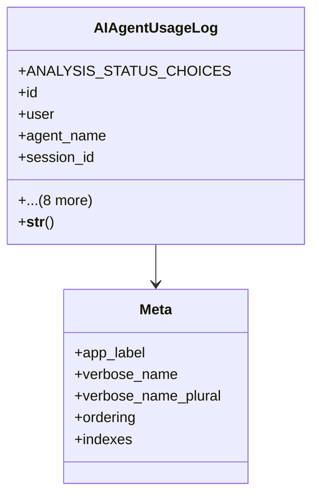

# admin_modules.reports.models

## Imports
- django.conf
- django.db
- django.utils.translation
- uuid

## Classes
- AIAgentUsageLog
  - attr: `ANALYSIS_STATUS_CHOICES`
  - attr: `id`
  - attr: `user`
  - attr: `agent_name`
  - attr: `session_id`
  - attr: `query_text`
  - attr: `response_text`
  - attr: `timestamp`
  - attr: `analysis_status`
  - attr: `is_within_scope`
  - attr: `analysis_details`
  - attr: `created_at`
  - attr: `updated_at`
  - method: `__str__`
- Meta
  - attr: `app_label`
  - attr: `verbose_name`
  - attr: `verbose_name_plural`
  - attr: `ordering`
  - attr: `indexes`

## Functions
- __str__

## Class Diagram

