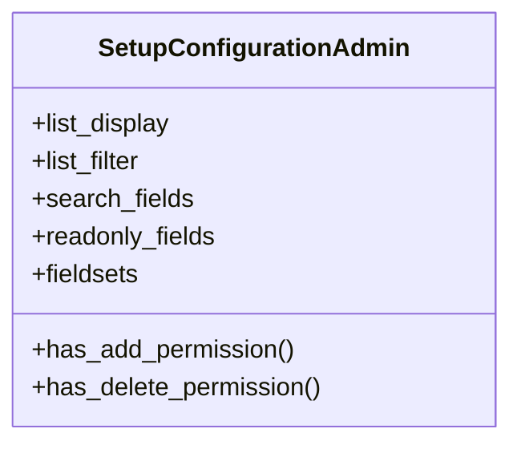

# admin_modules.setup_wizard.admin

## Imports
- django.contrib
- django.utils.translation
- models

## Classes
- SetupConfigurationAdmin
  - attr: `list_display`
  - attr: `list_filter`
  - attr: `search_fields`
  - attr: `readonly_fields`
  - attr: `fieldsets`
  - method: `has_add_permission`
  - method: `has_delete_permission`

## Functions
- has_add_permission
- has_delete_permission

## Class Diagram

