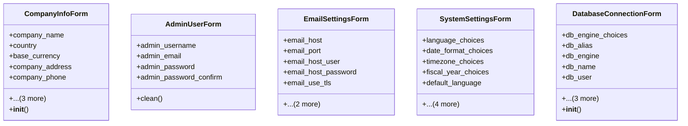

# admin_modules.setup_wizard.forms

## Imports
- core_modules.organization.models
- django
- django.contrib.auth.models
- django.core.exceptions
- django.utils.translation
- typing

## Classes
- CompanyInfoForm
  - attr: `company_name`
  - attr: `country`
  - attr: `base_currency`
  - attr: `company_address`
  - attr: `company_phone`
  - attr: `company_email`
  - attr: `tax_number`
  - attr: `company_logo`
  - method: `__init__`
- AdminUserForm
  - attr: `admin_username`
  - attr: `admin_email`
  - attr: `admin_password`
  - attr: `admin_password_confirm`
  - method: `clean`
- EmailSettingsForm
  - attr: `email_host`
  - attr: `email_port`
  - attr: `email_host_user`
  - attr: `email_host_password`
  - attr: `email_use_tls`
  - attr: `email_use_ssl`
  - attr: `default_from_email`
- SystemSettingsForm
  - attr: `language_choices`
  - attr: `date_format_choices`
  - attr: `timezone_choices`
  - attr: `fiscal_year_choices`
  - attr: `default_language`
  - attr: `default_currency`
  - attr: `timezone`
  - attr: `date_format`
  - attr: `fiscal_year_start`
- DatabaseConnectionForm
  - attr: `db_engine_choices`
  - attr: `db_alias`
  - attr: `db_engine`
  - attr: `db_name`
  - attr: `db_user`
  - attr: `db_password`
  - attr: `db_host`
  - attr: `db_port`
  - method: `__init__`

## Functions
- __init__
- clean
- __init__

## Module Variables
- `FORMS`

## Class Diagram

