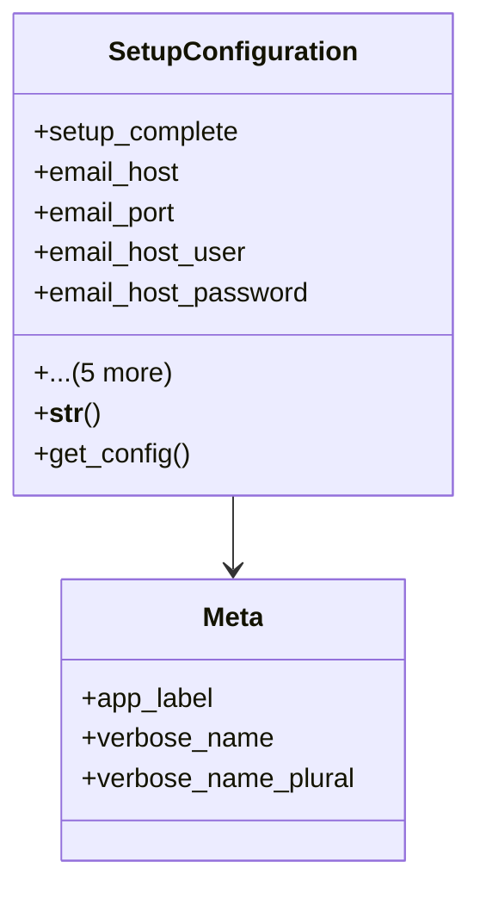

# admin_modules.setup_wizard.models

## Imports
- django.db
- django.utils.translation

## Classes
- SetupConfiguration
  - attr: `setup_complete`
  - attr: `email_host`
  - attr: `email_port`
  - attr: `email_host_user`
  - attr: `email_host_password`
  - attr: `email_use_tls`
  - attr: `email_use_ssl`
  - attr: `default_from_email`
  - attr: `created_at`
  - attr: `updated_at`
  - method: `__str__`
  - method: `get_config`
- Meta
  - attr: `app_label`
  - attr: `verbose_name`
  - attr: `verbose_name_plural`

## Functions
- __str__
- get_config

## Class Diagram

