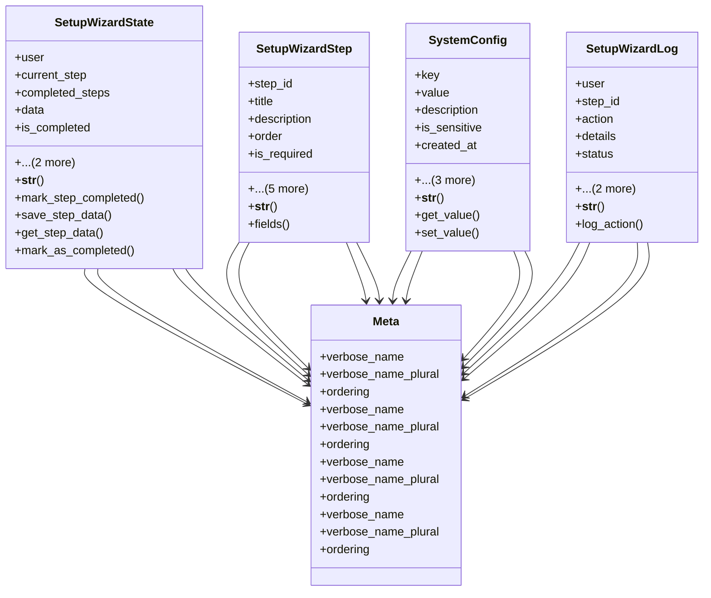

# admin_modules.setup_wizard.models.setup_wizard

## Imports
- django.contrib.auth.models
- django.db
- django.utils
- django.utils.translation
- json

## Classes
- SetupWizardState
  - attr: `user`
  - attr: `current_step`
  - attr: `completed_steps`
  - attr: `data`
  - attr: `is_completed`
  - attr: `created_at`
  - attr: `updated_at`
  - method: `__str__`
  - method: `mark_step_completed`
  - method: `save_step_data`
  - method: `get_step_data`
  - method: `mark_as_completed`
- SetupWizardStep
  - attr: `step_id`
  - attr: `title`
  - attr: `description`
  - attr: `order`
  - attr: `is_required`
  - attr: `fields_definition`
  - attr: `next_step`
  - attr: `prev_step`
  - attr: `created_at`
  - attr: `updated_at`
  - method: `__str__`
  - method: `fields`
- SystemConfig
  - attr: `key`
  - attr: `value`
  - attr: `description`
  - attr: `is_sensitive`
  - attr: `created_at`
  - attr: `updated_at`
  - attr: `created_by`
  - attr: `updated_by`
  - method: `__str__`
  - method: `get_value`
  - method: `set_value`
- SetupWizardLog
  - attr: `user`
  - attr: `step_id`
  - attr: `action`
  - attr: `details`
  - attr: `status`
  - attr: `timestamp`
  - attr: `ip_address`
  - method: `__str__`
  - method: `log_action`
- Meta
  - attr: `verbose_name`
  - attr: `verbose_name_plural`
  - attr: `ordering`
- Meta
  - attr: `verbose_name`
  - attr: `verbose_name_plural`
  - attr: `ordering`
- Meta
  - attr: `verbose_name`
  - attr: `verbose_name_plural`
  - attr: `ordering`
- Meta
  - attr: `verbose_name`
  - attr: `verbose_name_plural`
  - attr: `ordering`

## Functions
- __str__
- mark_step_completed
- save_step_data
- get_step_data
- mark_as_completed
- __str__
- fields
- __str__
- get_value
- set_value
- __str__
- log_action

## Class Diagram

