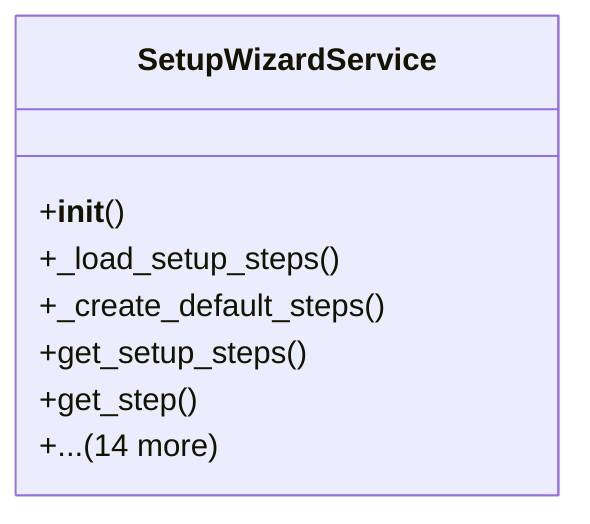

# admin_modules.setup_wizard.services.setup_wizard_service

## Imports
- datetime
- django.utils
- json
- logging
- os
- typing

## Classes
- SetupWizardService
  - method: `__init__`
  - method: `_load_setup_steps`
  - method: `_create_default_steps`
  - method: `get_setup_steps`
  - method: `get_step`
  - method: `save_step_data`
  - method: `_save_current_state`
  - method: `load_current_state`
  - method: `complete_setup`
  - method: `_apply_settings`
  - method: `_create_company`
  - method: `_create_admin_user`
  - method: `_apply_system_settings`
  - method: `_activate_modules`
  - method: `_configure_email`
  - method: `_configure_database`
  - method: `_configure_backup`
  - method: `is_setup_completed`
  - method: `reset_setup`

## Functions
- __init__
- _load_setup_steps
- _create_default_steps
- get_setup_steps
- get_step
- save_step_data
- _save_current_state
- load_current_state
- complete_setup
- _apply_settings
- _create_company
- _create_admin_user
- _apply_system_settings
- _activate_modules
- _configure_email
- _configure_database
- _configure_backup
- is_setup_completed
- reset_setup

## Module Variables
- `logger`

## Class Diagram

