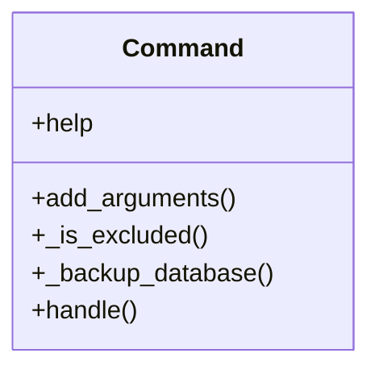

# admin_modules.system_backups.management.commands.create_backup

## Imports
- django.conf
- django.core.management.base
- django.utils
- os
- pathlib
- shutil
- subprocess
- system_backups.models
- tarfile
- zipfile

## Classes
- Command
  - attr: `help`
  - method: `add_arguments`
  - method: `_is_excluded`
  - method: `_backup_database`
  - method: `handle`

## Functions
- add_arguments
- _is_excluded
- _backup_database
- handle

## Class Diagram

