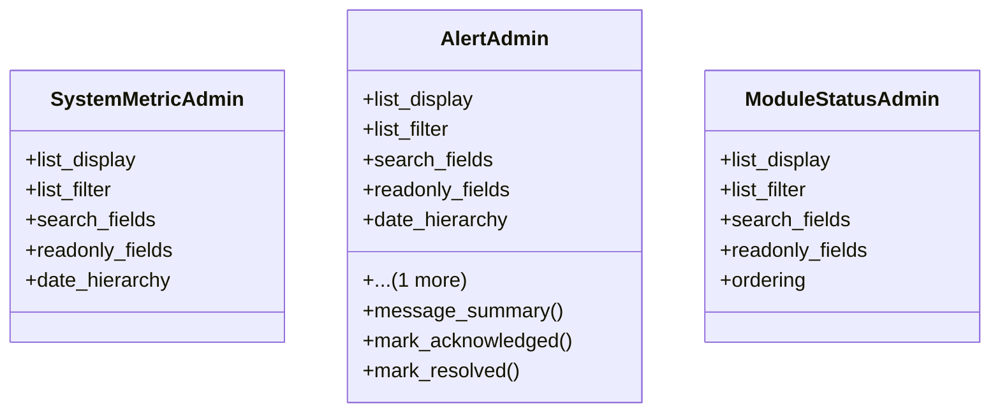

# admin_modules.system_monitoring.admin

## Imports
- django.contrib
- models

## Classes
- SystemMetricAdmin
  - attr: `list_display`
  - attr: `list_filter`
  - attr: `search_fields`
  - attr: `readonly_fields`
  - attr: `date_hierarchy`
- AlertAdmin
  - attr: `list_display`
  - attr: `list_filter`
  - attr: `search_fields`
  - attr: `readonly_fields`
  - attr: `date_hierarchy`
  - attr: `actions`
  - method: `message_summary`
  - method: `mark_acknowledged`
  - method: `mark_resolved`
- ModuleStatusAdmin
  - attr: `list_display`
  - attr: `list_filter`
  - attr: `search_fields`
  - attr: `readonly_fields`
  - attr: `ordering`

## Functions
- message_summary
- mark_acknowledged
- mark_resolved

## Class Diagram

