# admin_modules.system_monitoring.models.monitoring

## Imports
- django.contrib.auth
- django.db
- django.utils
- json

## Classes
- SystemResource
  - attr: `timestamp`
  - attr: `cpu_usage`
  - attr: `memory_usage`
  - attr: `disk_usage`
  - attr: `active_connections`
  - attr: `system_load`
  - method: `__str__`
- SystemAlert
  - attr: `SEVERITY_CHOICES`
  - attr: `RESOURCE_TYPE_CHOICES`
  - attr: `timestamp`
  - attr: `alert_type`
  - attr: `severity`
  - attr: `message`
  - attr: `resource_type`
  - attr: `resource_value`
  - attr: `threshold`
  - attr: `notified`
  - attr: `acknowledged`
  - attr: `acknowledged_by`
  - attr: `acknowledged_at`
  - method: `__str__`
  - method: `acknowledge`
- ModuleStatus
  - attr: `STATUS_CHOICES`
  - attr: `timestamp`
  - attr: `module_name`
  - attr: `status`
  - attr: `resource_usage`
  - attr: `is_active`
  - attr: `details`
  - method: `__str__`
- ModuleRecovery
  - attr: `ACTION_CHOICES`
  - attr: `timestamp`
  - attr: `module_name`
  - attr: `action`
  - attr: `reason`
  - attr: `success`
  - attr: `details`
  - attr: `initiated_by`
  - attr: `user`
  - method: `__str__`
- MonitoringConfig
  - attr: `name`
  - attr: `description`
  - attr: `monitoring_interval`
  - attr: `cpu_threshold_warning`
  - attr: `cpu_threshold_critical`
  - attr: `memory_threshold_warning`
  - attr: `memory_threshold_critical`
  - attr: `disk_threshold_warning`
  - attr: `disk_threshold_critical`
  - attr: `alert_cooldown`
  - attr: `history_retention_days`
  - attr: `modules_config`
  - attr: `notification_channels`
  - attr: `is_active`
  - attr: `created_at`
  - attr: `updated_at`
  - attr: `created_by`
  - attr: `updated_by`
  - method: `__str__`
  - method: `get_modules_config`
  - method: `set_modules_config`
  - method: `get_notification_channels`
  - method: `set_notification_channels`
- PerformanceMetric
  - attr: `timestamp`
  - attr: `module_name`
  - attr: `metric_name`
  - attr: `metric_value`
  - attr: `metric_unit`
  - attr: `context`
  - method: `__str__`
- AIModuleMetric
  - attr: `timestamp`
  - attr: `module_name`
  - attr: `requests_count`
  - attr: `average_response_time`
  - attr: `max_response_time`
  - attr: `error_count`
  - attr: `memory_usage`
  - attr: `cpu_usage`
  - attr: `tokens_used`
  - method: `__str__`
- ResourcePolicy
  - attr: `POLICY_TYPE_CHOICES`
  - attr: `ACTION_CHOICES`
  - attr: `policy_name`
  - attr: `description`
  - attr: `policy_type`
  - attr: `target_module`
  - attr: `condition`
  - attr: `action`
  - attr: `priority`
  - attr: `is_active`
  - attr: `created_at`
  - attr: `updated_at`
  - attr: `created_by`
  - attr: `updated_by`
  - method: `__str__`
- RecoveryLog
  - attr: `RECOVERY_TYPE_CHOICES`
  - attr: `STATUS_CHOICES`
  - attr: `timestamp`
  - attr: `recovery_type`
  - attr: `modules`
  - attr: `initiated_by`
  - attr: `initiated_at`
  - attr: `completed_at`
  - attr: `status`
  - attr: `error_message`
  - attr: `notes`
  - method: `__str__`
  - method: `get_modules_list`
  - method: `set_modules_list`
- Meta
  - attr: `verbose_name`
  - attr: `verbose_name_plural`
  - attr: `ordering`
  - attr: `indexes`
- Meta
  - attr: `verbose_name`
  - attr: `verbose_name_plural`
  - attr: `ordering`
  - attr: `indexes`
- Meta
  - attr: `verbose_name`
  - attr: `verbose_name_plural`
  - attr: `ordering`
  - attr: `indexes`
- Meta
  - attr: `verbose_name`
  - attr: `verbose_name_plural`
  - attr: `ordering`
  - attr: `indexes`
- Meta
  - attr: `verbose_name`
  - attr: `verbose_name_plural`
  - attr: `ordering`
- Meta
  - attr: `verbose_name`
  - attr: `verbose_name_plural`
  - attr: `ordering`
  - attr: `indexes`
- Meta
  - attr: `verbose_name`
  - attr: `verbose_name_plural`
  - attr: `ordering`
  - attr: `indexes`
- Meta
  - attr: `verbose_name`
  - attr: `verbose_name_plural`
  - attr: `ordering`
- Meta
  - attr: `verbose_name`
  - attr: `verbose_name_plural`
  - attr: `ordering`
  - attr: `indexes`

## Functions
- __str__
- __str__
- acknowledge
- __str__
- __str__
- __str__
- get_modules_config
- set_modules_config
- get_notification_channels
- set_notification_channels
- __str__
- __str__
- __str__
- __str__
- get_modules_list
- set_modules_list

## Module Variables
- `User`

## Class Diagram

```mermaid
classDiagram
    class SystemResource {
        +timestamp
        +cpu_usage
        +memory_usage
        +disk_usage
        +active_connections
        +... (1 more)
        +__str__()
    }
    class SystemAlert {
        +SEVERITY_CHOICES
        +RESOURCE_TYPE_CHOICES
        +timestamp
        +alert_type
        +severity
        +... (8 more)
        +__str__()
        +acknowledge()
    }
    class ModuleStatus {
        +STATUS_CHOICES
        +timestamp
        +module_name
        +status
        +resource_usage
        +... (2 more)
        +__str__()
    }
    class ModuleRecovery {
        +ACTION_CHOICES
        +timestamp
        +module_name
        +action
        +reason
        +... (4 more)
        +__str__()
    }
    class MonitoringConfig {
        +name
        +description
        +monitoring_interval
        +cpu_threshold_warning
        +cpu_threshold_critical
        +... (13 more)
        +__str__()
        +get_modules_config()
        +set_modules_config()
        +get_notification_channels()
        +set_notification_channels()
    }
    class PerformanceMetric {
        +timestamp
        +module_name
        +metric_name
        +metric_value
        +metric_unit
        +... (1 more)
        +__str__()
    }
    class AIModuleMetric {
        +timestamp
        +module_name
        +requests_count
        +average_response_time
        +max_response_time
        +... (4 more)
        +__str__()
    }
    class ResourcePolicy {
        +POLICY_TYPE_CHOICES
        +ACTION_CHOICES
        +policy_name
        +description
        +policy_type
        +... (9 more)
        +__str__()
    }
    class RecoveryLog {
        +RECOVERY_TYPE_CHOICES
        +STATUS_CHOICES
        +timestamp
        +recovery_type
        +modules
        +... (6 more)
        +__str__()
        +get_modules_list()
        +set_modules_list()
    }
    class Meta {
        +verbose_name
        +verbose_name_plural
        +ordering
        +indexes
    }
    class Meta {
        +verbose_name
        +verbose_name_plural
        +ordering
        +indexes
    }
    class Meta {
        +verbose_name
        +verbose_name_plural
        +ordering
        +indexes
    }
    class Meta {
        +verbose_name
        +verbose_name_plural
        +ordering
        +indexes
    }
    class Meta {
        +verbose_name
        +verbose_name_plural
        +ordering
    }
    class Meta {
        +verbose_name
        +verbose_name_plural
        +ordering
        +indexes
    }
    class Meta {
        +verbose_name
        +verbose_name_plural
        +ordering
        +indexes
    }
    class Meta {
        +verbose_name
        +verbose_name_plural
        +ordering
    }
    class Meta {
        +verbose_name
        +verbose_name_plural
        +ordering
        +indexes
    }
    SystemResource --> Meta
    SystemResource --> Meta
    SystemResource --> Meta
    SystemResource --> Meta
    SystemResource --> Meta
    SystemResource --> Meta
    SystemResource --> Meta
    SystemResource --> Meta
    SystemResource --> Meta
    SystemAlert --> Meta
    SystemAlert --> Meta
    SystemAlert --> Meta
    SystemAlert --> Meta
    SystemAlert --> Meta
    SystemAlert --> Meta
    SystemAlert --> Meta
    SystemAlert --> Meta
    SystemAlert --> Meta
    ModuleStatus --> Meta
    ModuleStatus --> Meta
    ModuleStatus --> Meta
    ModuleStatus --> Meta
    ModuleStatus --> Meta
    ModuleStatus --> Meta
    ModuleStatus --> Meta
    ModuleStatus --> Meta
    ModuleStatus --> Meta
    ModuleRecovery --> Meta
    ModuleRecovery --> Meta
    ModuleRecovery --> Meta
    ModuleRecovery --> Meta
    ModuleRecovery --> Meta
    ModuleRecovery --> Meta
    ModuleRecovery --> Meta
    ModuleRecovery --> Meta
    ModuleRecovery --> Meta
    MonitoringConfig --> Meta
    MonitoringConfig --> Meta
    MonitoringConfig --> Meta
    MonitoringConfig --> Meta
    MonitoringConfig --> Meta
    MonitoringConfig --> Meta
    MonitoringConfig --> Meta
    MonitoringConfig --> Meta
    MonitoringConfig --> Meta
    PerformanceMetric --> Meta
    PerformanceMetric --> Meta
    PerformanceMetric --> Meta
    PerformanceMetric --> Meta
    PerformanceMetric --> Meta
    PerformanceMetric --> Meta
    PerformanceMetric --> Meta
    PerformanceMetric --> Meta
    PerformanceMetric --> Meta
    AIModuleMetric --> Meta
    AIModuleMetric --> Meta
    AIModuleMetric --> Meta
    AIModuleMetric --> Meta
    AIModuleMetric --> Meta
    AIModuleMetric --> Meta
    AIModuleMetric --> Meta
    AIModuleMetric --> Meta
    AIModuleMetric --> Meta
    ResourcePolicy --> Meta
    ResourcePolicy --> Meta
    ResourcePolicy --> Meta
    ResourcePolicy --> Meta
    ResourcePolicy --> Meta
    ResourcePolicy --> Meta
    ResourcePolicy --> Meta
    ResourcePolicy --> Meta
    ResourcePolicy --> Meta
    RecoveryLog --> Meta
    RecoveryLog --> Meta
    RecoveryLog --> Meta
    RecoveryLog --> Meta
    RecoveryLog --> Meta
    RecoveryLog --> Meta
    RecoveryLog --> Meta
    RecoveryLog --> Meta
    RecoveryLog --> Meta
```

