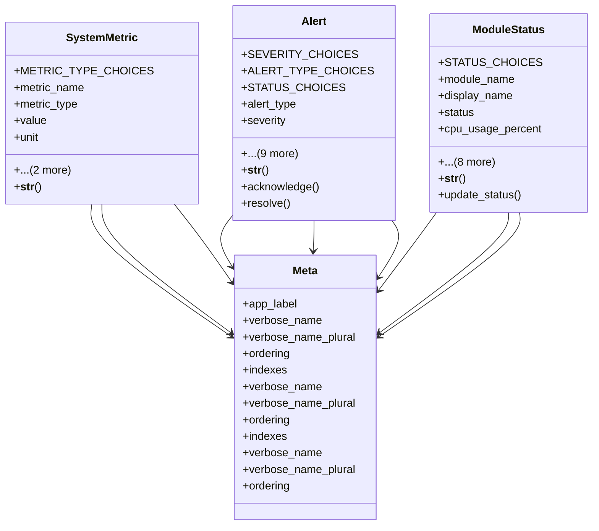

# admin_modules.system_monitoring.models_improved

## Imports
- django.conf
- django.db
- django.utils
- django.utils.translation

## Classes
- SystemMetric
  - attr: `METRIC_TYPE_CHOICES`
  - attr: `metric_name`
  - attr: `metric_type`
  - attr: `value`
  - attr: `unit`
  - attr: `timestamp`
  - attr: `source`
  - method: `__str__`
- Alert
  - attr: `SEVERITY_CHOICES`
  - attr: `ALERT_TYPE_CHOICES`
  - attr: `STATUS_CHOICES`
  - attr: `alert_type`
  - attr: `severity`
  - attr: `message`
  - attr: `source`
  - attr: `timestamp`
  - attr: `status`
  - attr: `acknowledged_by`
  - attr: `acknowledged_at`
  - attr: `resolved_at`
  - attr: `resolution_notes`
  - attr: `related_metric`
  - method: `__str__`
  - method: `acknowledge`
  - method: `resolve`
- ModuleStatus
  - attr: `STATUS_CHOICES`
  - attr: `module_name`
  - attr: `display_name`
  - attr: `status`
  - attr: `cpu_usage_percent`
  - attr: `memory_usage_mb`
  - attr: `disk_usage_mb`
  - attr: `response_time_ms`
  - attr: `active_users`
  - attr: `last_error_message`
  - attr: `last_error_timestamp`
  - attr: `last_heartbeat`
  - attr: `version`
  - method: `__str__`
  - method: `update_status`
- Meta
  - attr: `app_label`
  - attr: `verbose_name`
  - attr: `verbose_name_plural`
  - attr: `ordering`
  - attr: `indexes`
- Meta
  - attr: `verbose_name`
  - attr: `verbose_name_plural`
  - attr: `ordering`
  - attr: `indexes`
- Meta
  - attr: `verbose_name`
  - attr: `verbose_name_plural`
  - attr: `ordering`

## Functions
- __str__
- __str__
- acknowledge
- resolve
- __str__
- update_status

## Class Diagram

