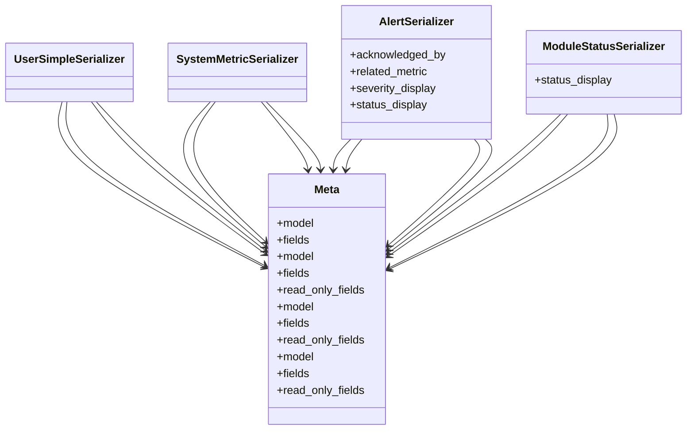

# admin_modules.system_monitoring.serializers

## Imports
- django.contrib.auth
- models
- rest_framework

## Classes
- UserSimpleSerializer
- SystemMetricSerializer
- AlertSerializer
  - attr: `acknowledged_by`
  - attr: `related_metric`
  - attr: `severity_display`
  - attr: `status_display`
- ModuleStatusSerializer
  - attr: `status_display`
- Meta
  - attr: `model`
  - attr: `fields`
- Meta
  - attr: `model`
  - attr: `fields`
  - attr: `read_only_fields`
- Meta
  - attr: `model`
  - attr: `fields`
  - attr: `read_only_fields`
- Meta
  - attr: `model`
  - attr: `fields`
  - attr: `read_only_fields`

## Module Variables
- `User`

## Class Diagram

