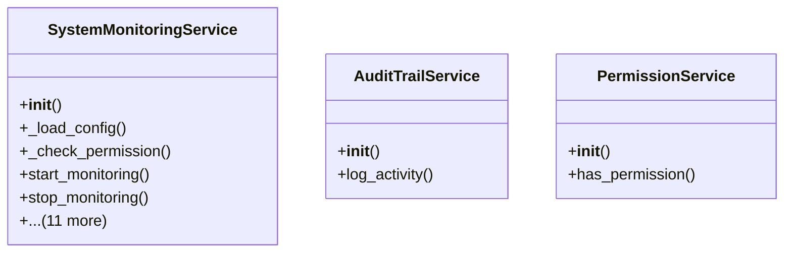

# admin_modules.system_monitoring.services.monitoring_service

## Imports
- core_modules.activity_log.services.audit_trail_service
- core_modules.permissions.services.permission_service
- datetime
- django.conf
- django.contrib.auth
- django.core.exceptions
- django.db.models
- django.utils
- json
- logging
- models
- os
- psutil
- threading
- time
- typing

## Classes
- SystemMonitoringService
  - method: `__init__`
  - method: `_load_config`
  - method: `_check_permission`
  - method: `start_monitoring`
  - method: `stop_monitoring`
  - method: `_monitoring_loop`
  - method: `_collect_and_save_system_metrics`
  - method: `_analyze_metrics_and_alert`
  - method: `_send_notification`
  - method: `_cleanup_old_data`
  - method: `get_system_metrics`
  - method: `get_active_alerts`
  - method: `acknowledge_alert`
  - method: `resolve_alert`
  - method: `update_module_status`
  - method: `get_module_statuses`
- AuditTrailService
  - method: `__init__`
  - method: `log_activity`
- PermissionService
  - method: `__init__`
  - method: `has_permission`

## Functions
- __init__
- _load_config
- _check_permission
- start_monitoring
- stop_monitoring
- _monitoring_loop
- _collect_and_save_system_metrics
- _analyze_metrics_and_alert
- _send_notification
- _cleanup_old_data
- get_system_metrics
- get_active_alerts
- acknowledge_alert
- resolve_alert
- update_module_status
- get_module_statuses
- __init__
- log_activity
- __init__
- has_permission

## Module Variables
- `log_dir`
- `log_file`
- `logger`

## Class Diagram

