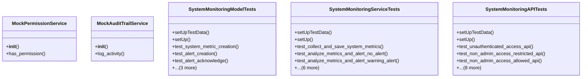

# admin_modules.system_monitoring.tests

## Imports
- datetime
- django.contrib.auth
- django.core.exceptions
- django.test
- django.urls
- django.utils
- json
- models
- rest_framework
- rest_framework.test
- services.monitoring_service
- unittest.mock

## Classes
- MockPermissionService
  - method: `__init__`
  - method: `has_permission`
- MockAuditTrailService
  - method: `__init__`
  - method: `log_activity`
- SystemMonitoringModelTests
  - method: `setUpTestData`
  - method: `setUp`
  - method: `test_system_metric_creation`
  - method: `test_alert_creation`
  - method: `test_alert_acknowledge`
  - method: `test_alert_resolve`
  - method: `test_module_status_creation`
  - method: `test_module_status_update_status`
- SystemMonitoringServiceTests
  - method: `setUpTestData`
  - method: `setUp`
  - method: `test_collect_and_save_system_metrics`
  - method: `test_analyze_metrics_and_alert_no_alert`
  - method: `test_analyze_metrics_and_alert_warning_alert`
  - method: `test_analyze_metrics_and_alert_critical_alert`
  - method: `test_alert_cooldown`
  - method: `test_cleanup_old_data`
  - method: `test_acknowledge_alert_service`
  - method: `test_acknowledge_alert_permission_denied`
  - method: `test_resolve_alert_service`
- SystemMonitoringAPITests
  - method: `setUpTestData`
  - method: `setUp`
  - method: `test_unauthenticated_access_api`
  - method: `test_non_admin_access_restricted_api`
  - method: `test_non_admin_access_allowed_api`
  - method: `test_list_system_metrics_api`
  - method: `test_retrieve_system_metric_api`
  - method: `test_list_alerts_api`
  - method: `test_acknowledge_alert_api`
  - method: `test_resolve_alert_api`
  - method: `test_resolve_alert_already_resolved_api`
  - method: `test_list_module_status_api`
  - method: `test_retrieve_module_status_api`

## Functions
- __init__
- has_permission
- __init__
- log_activity
- setUpTestData
- setUp
- test_system_metric_creation
- test_alert_creation
- test_alert_acknowledge
- test_alert_resolve
- test_module_status_creation
- test_module_status_update_status
- setUpTestData
- setUp
- test_collect_and_save_system_metrics
- test_analyze_metrics_and_alert_no_alert
- test_analyze_metrics_and_alert_warning_alert
- test_analyze_metrics_and_alert_critical_alert
- test_alert_cooldown
- test_cleanup_old_data
- test_acknowledge_alert_service
- test_acknowledge_alert_permission_denied
- test_resolve_alert_service
- setUpTestData
- setUp
- test_unauthenticated_access_api
- test_non_admin_access_restricted_api
- test_non_admin_access_allowed_api
- test_list_system_metrics_api
- test_retrieve_system_metric_api
- test_list_alerts_api
- test_acknowledge_alert_api
- test_resolve_alert_api
- test_resolve_alert_already_resolved_api
- test_list_module_status_api
- test_retrieve_module_status_api

## Module Variables
- `User`

## Class Diagram

