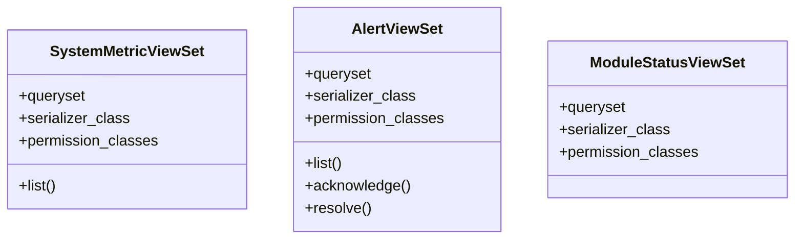

# admin_modules.system_monitoring.views

## Imports
- django.utils
- models
- rest_framework
- rest_framework.decorators
- rest_framework.permissions
- rest_framework.response
- serializers
- services.monitoring_service

## Classes
- SystemMetricViewSet
  - attr: `queryset`
  - attr: `serializer_class`
  - attr: `permission_classes`
  - method: `list`
- AlertViewSet
  - attr: `queryset`
  - attr: `serializer_class`
  - attr: `permission_classes`
  - method: `list`
  - method: `acknowledge`
  - method: `resolve`
- ModuleStatusViewSet
  - attr: `queryset`
  - attr: `serializer_class`
  - attr: `permission_classes`

## Functions
- list
- list
- acknowledge
- resolve

## Class Diagram

