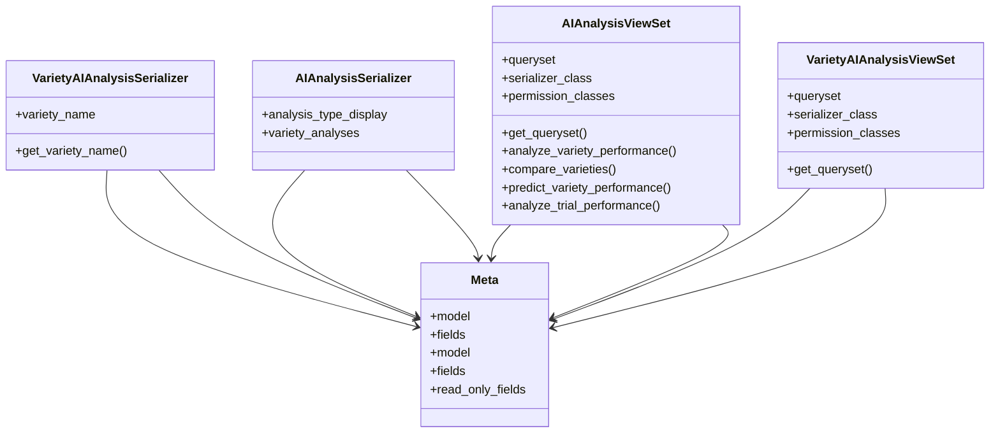

# agricultural_modules.agricultural_experiments.api.ai_analysis_api

## Imports
- models.ai_analysis
- rest_framework
- rest_framework.decorators
- rest_framework.permissions
- rest_framework.response
- services.ai_analysis_service

## Classes
- VarietyAIAnalysisSerializer
  - attr: `variety_name`
  - method: `get_variety_name`
- AIAnalysisSerializer
  - attr: `analysis_type_display`
  - attr: `variety_analyses`
- AIAnalysisViewSet
  - attr: `queryset`
  - attr: `serializer_class`
  - attr: `permission_classes`
  - method: `get_queryset`
  - method: `analyze_variety_performance`
  - method: `compare_varieties`
  - method: `predict_variety_performance`
  - method: `analyze_trial_performance`
- VarietyAIAnalysisViewSet
  - attr: `queryset`
  - attr: `serializer_class`
  - attr: `permission_classes`
  - method: `get_queryset`
- Meta
  - attr: `model`
  - attr: `fields`
- Meta
  - attr: `model`
  - attr: `fields`
  - attr: `read_only_fields`

## Functions
- get_variety_name
- get_queryset
- analyze_variety_performance
- compare_varieties
- predict_variety_performance
- analyze_trial_performance
- get_queryset

## Class Diagram

