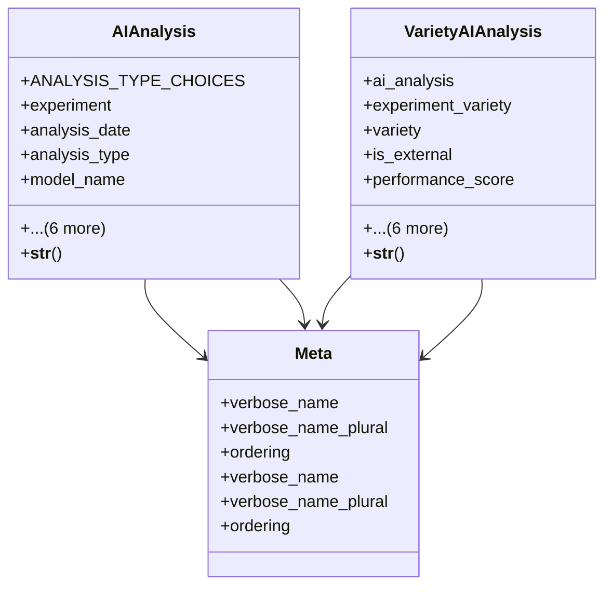

# agricultural_modules.agricultural_experiments.models.ai_analysis

## Imports
- django.contrib.auth
- django.db
- django.utils.translation
- experiment
- variety

## Classes
- AIAnalysis
  - attr: `ANALYSIS_TYPE_CHOICES`
  - attr: `experiment`
  - attr: `analysis_date`
  - attr: `analysis_type`
  - attr: `model_name`
  - attr: `model_version`
  - attr: `input_parameters`
  - attr: `results`
  - attr: `confidence_score`
  - attr: `created_by`
  - attr: `created_at`
  - method: `__str__`
- VarietyAIAnalysis
  - attr: `ai_analysis`
  - attr: `experiment_variety`
  - attr: `variety`
  - attr: `is_external`
  - attr: `performance_score`
  - attr: `strengths`
  - attr: `weaknesses`
  - attr: `recommendations`
  - attr: `predicted_yield`
  - attr: `predicted_market_potential`
  - attr: `suggested_price`
  - method: `__str__`
- Meta
  - attr: `verbose_name`
  - attr: `verbose_name_plural`
  - attr: `ordering`
- Meta
  - attr: `verbose_name`
  - attr: `verbose_name_plural`
  - attr: `ordering`

## Functions
- __str__
- __str__

## Module Variables
- `User`

## Class Diagram

