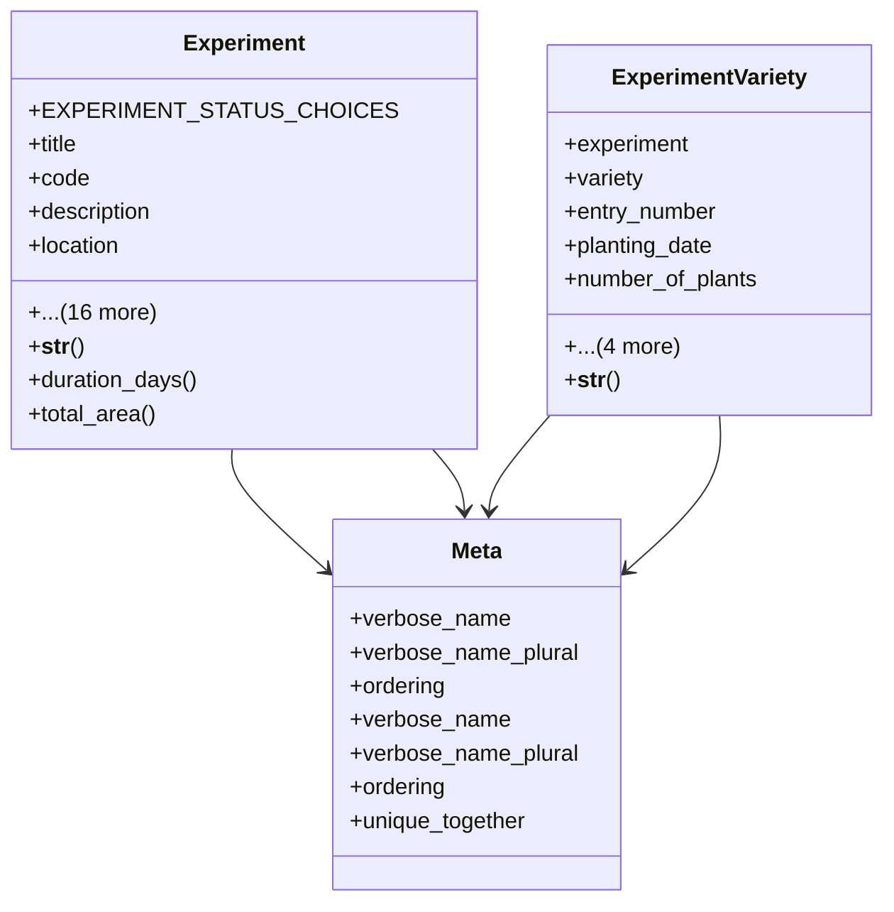

# agricultural_modules.agricultural_experiments.models.experiment

## Imports
- django.contrib.auth
- django.db
- django.utils
- django.utils.translation
- location
- season
- variety

## Classes
- Experiment
  - attr: `EXPERIMENT_STATUS_CHOICES`
  - attr: `title`
  - attr: `code`
  - attr: `description`
  - attr: `location`
  - attr: `season`
  - attr: `start_date`
  - attr: `end_date`
  - attr: `actual_end_date`
  - attr: `status`
  - attr: `replications`
  - attr: `plot_size`
  - attr: `plants_per_plot`
  - attr: `row_spacing`
  - attr: `plant_spacing`
  - attr: `objectives`
  - attr: `notes`
  - attr: `created_at`
  - attr: `updated_at`
  - attr: `created_by`
  - attr: `updated_by`
  - method: `__str__`
  - method: `duration_days`
  - method: `total_area`
- ExperimentVariety
  - attr: `experiment`
  - attr: `variety`
  - attr: `entry_number`
  - attr: `planting_date`
  - attr: `number_of_plants`
  - attr: `area_planted_sqm`
  - attr: `notes`
  - attr: `created_at`
  - attr: `updated_at`
  - method: `__str__`
- Meta
  - attr: `verbose_name`
  - attr: `verbose_name_plural`
  - attr: `ordering`
- Meta
  - attr: `verbose_name`
  - attr: `verbose_name_plural`
  - attr: `ordering`
  - attr: `unique_together`

## Functions
- __str__
- duration_days
- total_area
- __str__

## Module Variables
- `User`

## Class Diagram

