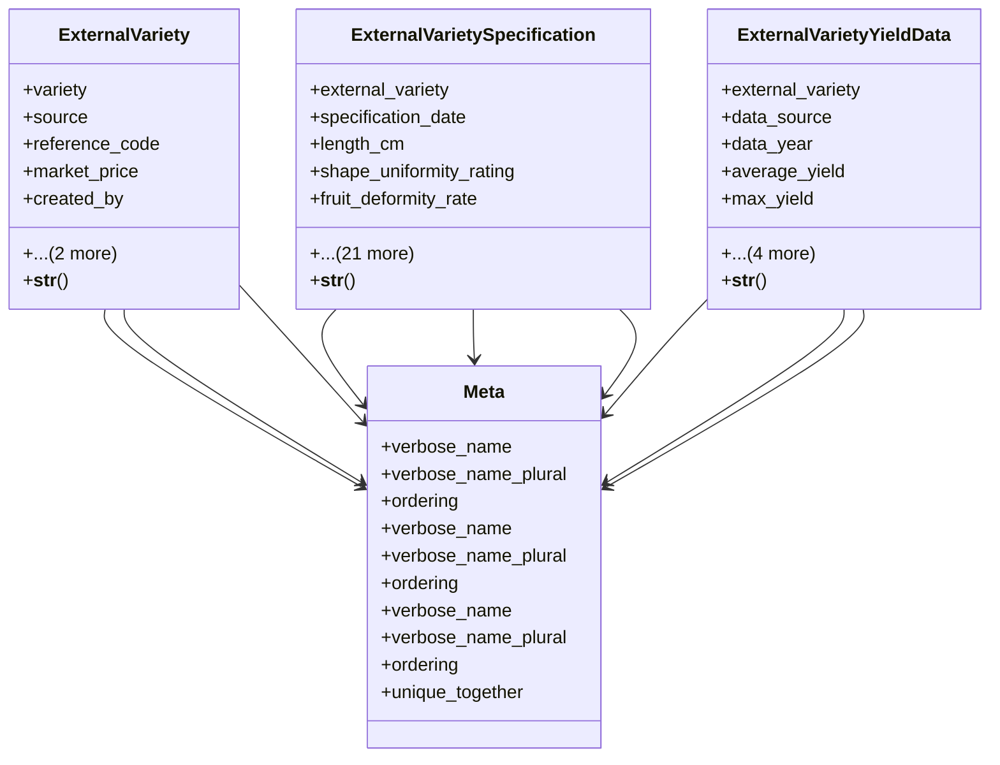

# agricultural_modules.agricultural_experiments.models.external_variety

## Imports
- django.contrib.auth
- django.core.validators
- django.db
- django.utils.translation
- variety

## Classes
- ExternalVariety
  - attr: `variety`
  - attr: `source`
  - attr: `reference_code`
  - attr: `market_price`
  - attr: `created_by`
  - attr: `created_at`
  - attr: `updated_at`
  - method: `__str__`
- ExternalVarietySpecification
  - attr: `external_variety`
  - attr: `specification_date`
  - attr: `length_cm`
  - attr: `shape_uniformity_rating`
  - attr: `fruit_deformity_rate`
  - attr: `firmness_rating`
  - attr: `color_description`
  - attr: `color_rating`
  - attr: `storage_transport_tolerance_rating`
  - attr: `brix_value`
  - attr: `earliness_rating`
  - attr: `plant_vigor_rating`
  - attr: `leaf_shape_description`
  - attr: `fruit_coverage_rating`
  - attr: `fungal_resistance_rating`
  - attr: `bacterial_resistance_rating`
  - attr: `insect_resistance_rating`
  - attr: `viral_resistance_rating`
  - attr: `cold_tolerance_rating`
  - attr: `heat_tolerance_rating`
  - attr: `soil_salinity_tolerance_rating`
  - attr: `water_salinity_tolerance_rating`
  - attr: `drought_tolerance_rating`
  - attr: `notes`
  - attr: `created_by`
  - attr: `created_at`
  - method: `__str__`
- ExternalVarietyYieldData
  - attr: `external_variety`
  - attr: `data_source`
  - attr: `data_year`
  - attr: `average_yield`
  - attr: `max_yield`
  - attr: `min_yield`
  - attr: `notes`
  - attr: `created_by`
  - attr: `created_at`
  - method: `__str__`
- Meta
  - attr: `verbose_name`
  - attr: `verbose_name_plural`
  - attr: `ordering`
- Meta
  - attr: `verbose_name`
  - attr: `verbose_name_plural`
  - attr: `ordering`
- Meta
  - attr: `verbose_name`
  - attr: `verbose_name_plural`
  - attr: `ordering`
  - attr: `unique_together`

## Functions
- __str__
- __str__
- __str__

## Module Variables
- `User`
- `RATING_CHOICES`

## Class Diagram

