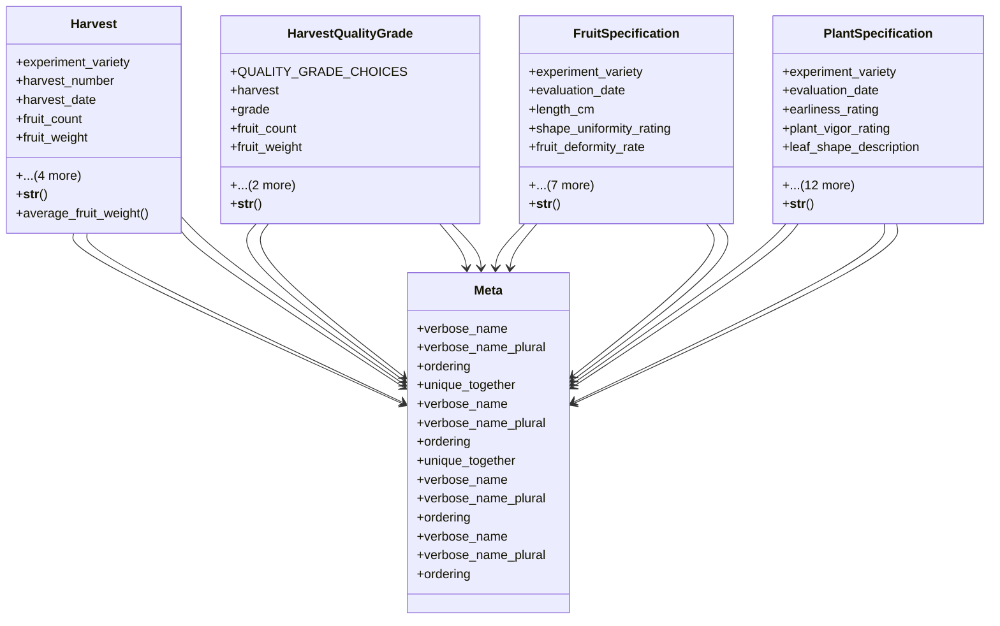

# agricultural_modules.agricultural_experiments.models.harvest

## Imports
- django.contrib.auth
- django.core.validators
- django.db
- django.utils.translation
- experiment

## Classes
- Harvest
  - attr: `experiment_variety`
  - attr: `harvest_number`
  - attr: `harvest_date`
  - attr: `fruit_count`
  - attr: `fruit_weight`
  - attr: `notes`
  - attr: `created_at`
  - attr: `updated_at`
  - attr: `created_by`
  - method: `__str__`
  - method: `average_fruit_weight`
- HarvestQualityGrade
  - attr: `QUALITY_GRADE_CHOICES`
  - attr: `harvest`
  - attr: `grade`
  - attr: `fruit_count`
  - attr: `fruit_weight`
  - attr: `created_at`
  - attr: `updated_at`
  - method: `__str__`
- FruitSpecification
  - attr: `experiment_variety`
  - attr: `evaluation_date`
  - attr: `length_cm`
  - attr: `shape_uniformity_rating`
  - attr: `fruit_deformity_rate`
  - attr: `firmness_rating`
  - attr: `color_description`
  - attr: `color_rating`
  - attr: `storage_transport_tolerance_rating`
  - attr: `brix_value`
  - attr: `notes`
  - attr: `created_at`
  - method: `__str__`
- PlantSpecification
  - attr: `experiment_variety`
  - attr: `evaluation_date`
  - attr: `earliness_rating`
  - attr: `plant_vigor_rating`
  - attr: `leaf_shape_description`
  - attr: `fruit_coverage_rating`
  - attr: `fungal_resistance_rating`
  - attr: `bacterial_resistance_rating`
  - attr: `insect_resistance_rating`
  - attr: `viral_resistance_rating`
  - attr: `cold_tolerance_rating`
  - attr: `heat_tolerance_rating`
  - attr: `soil_salinity_tolerance_rating`
  - attr: `water_salinity_tolerance_rating`
  - attr: `drought_tolerance_rating`
  - attr: `notes`
  - attr: `created_at`
  - method: `__str__`
- Meta
  - attr: `verbose_name`
  - attr: `verbose_name_plural`
  - attr: `ordering`
  - attr: `unique_together`
- Meta
  - attr: `verbose_name`
  - attr: `verbose_name_plural`
  - attr: `ordering`
  - attr: `unique_together`
- Meta
  - attr: `verbose_name`
  - attr: `verbose_name_plural`
  - attr: `ordering`
- Meta
  - attr: `verbose_name`
  - attr: `verbose_name_plural`
  - attr: `ordering`

## Functions
- __str__
- average_fruit_weight
- __str__
- __str__
- __str__

## Module Variables
- `User`
- `RATING_CHOICES`

## Class Diagram

