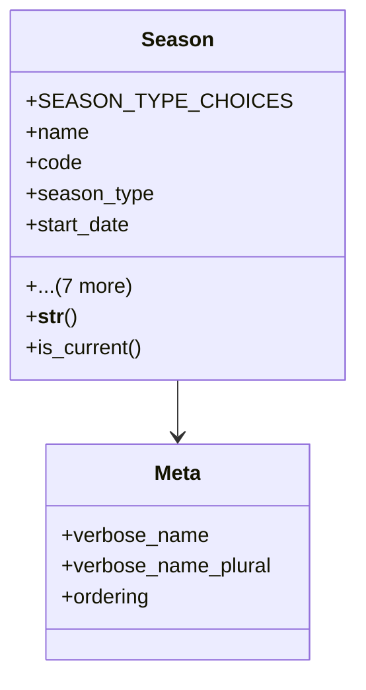

# agricultural_modules.agricultural_experiments.models.season

## Imports
- django.contrib.auth
- django.db
- django.utils
- django.utils.translation

## Classes
- Season
  - attr: `SEASON_TYPE_CHOICES`
  - attr: `name`
  - attr: `code`
  - attr: `season_type`
  - attr: `start_date`
  - attr: `end_date`
  - attr: `is_active`
  - attr: `notes`
  - attr: `created_at`
  - attr: `updated_at`
  - attr: `created_by`
  - attr: `updated_by`
  - method: `__str__`
  - method: `is_current`
- Meta
  - attr: `verbose_name`
  - attr: `verbose_name_plural`
  - attr: `ordering`

## Functions
- __str__
- is_current

## Module Variables
- `User`

## Class Diagram

