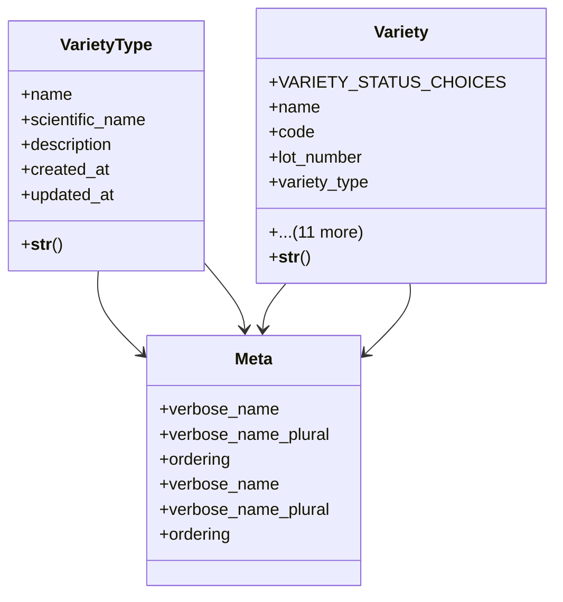

# agricultural_modules.agricultural_experiments.models.variety

## Imports
- django.contrib.auth
- django.db
- django.utils.translation

## Classes
- VarietyType
  - attr: `name`
  - attr: `scientific_name`
  - attr: `description`
  - attr: `created_at`
  - attr: `updated_at`
  - method: `__str__`
- Variety
  - attr: `VARIETY_STATUS_CHOICES`
  - attr: `name`
  - attr: `code`
  - attr: `lot_number`
  - attr: `variety_type`
  - attr: `is_competitor`
  - attr: `competitor_name`
  - attr: `competitor_price`
  - attr: `status`
  - attr: `description`
  - attr: `seed_source`
  - attr: `seed_inventory_item`
  - attr: `created_at`
  - attr: `updated_at`
  - attr: `created_by`
  - attr: `updated_by`
  - method: `__str__`
- Meta
  - attr: `verbose_name`
  - attr: `verbose_name_plural`
  - attr: `ordering`
- Meta
  - attr: `verbose_name`
  - attr: `verbose_name_plural`
  - attr: `ordering`

## Functions
- __str__
- __str__

## Module Variables
- `User`

## Class Diagram

