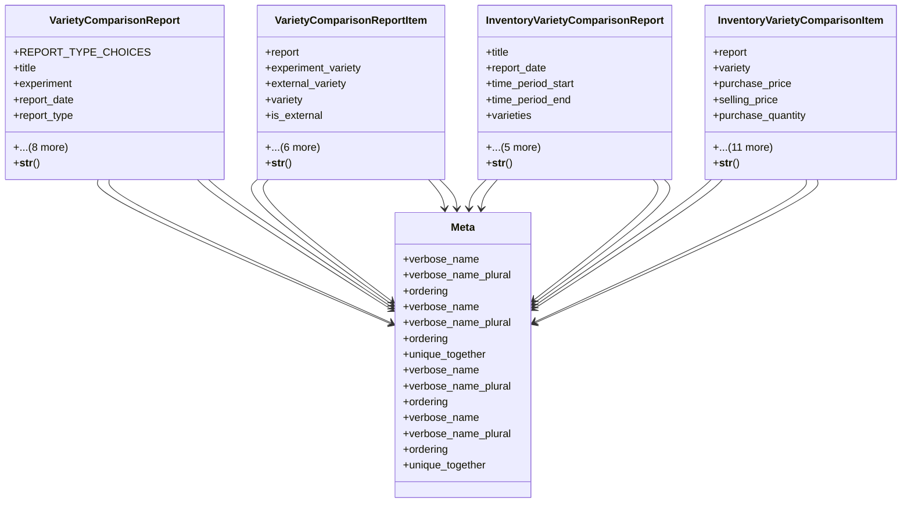

# agricultural_modules.agricultural_experiments.models.variety_comparison_report

## Imports
- django.contrib.auth
- django.db
- django.utils.translation
- experiment
- external_variety
- variety

## Classes
- VarietyComparisonReport
  - attr: `REPORT_TYPE_CHOICES`
  - attr: `title`
  - attr: `experiment`
  - attr: `report_date`
  - attr: `report_type`
  - attr: `time_period_start`
  - attr: `time_period_end`
  - attr: `criteria`
  - attr: `results`
  - attr: `summary`
  - attr: `created_by`
  - attr: `created_at`
  - attr: `updated_at`
  - method: `__str__`
- VarietyComparisonReportItem
  - attr: `report`
  - attr: `experiment_variety`
  - attr: `external_variety`
  - attr: `variety`
  - attr: `is_external`
  - attr: `performance_data`
  - attr: `pricing_data`
  - attr: `sales_data`
  - attr: `inventory_data`
  - attr: `customer_data`
  - attr: `engineer_data`
  - method: `__str__`
- InventoryVarietyComparisonReport
  - attr: `title`
  - attr: `report_date`
  - attr: `time_period_start`
  - attr: `time_period_end`
  - attr: `varieties`
  - attr: `criteria`
  - attr: `results`
  - attr: `summary`
  - attr: `created_by`
  - attr: `created_at`
  - method: `__str__`
- InventoryVarietyComparisonItem
  - attr: `report`
  - attr: `variety`
  - attr: `purchase_price`
  - attr: `selling_price`
  - attr: `purchase_quantity`
  - attr: `sales_quantity`
  - attr: `purchase_volume`
  - attr: `sales_volume`
  - attr: `inventory_turnover_rate`
  - attr: `capital_recovery_rate`
  - attr: `sales_recovery_rate`
  - attr: `engineers_count`
  - attr: `engineers_sales_percentage`
  - attr: `customers_count`
  - attr: `customers_sales_percentage`
  - attr: `additional_data`
  - method: `__str__`
- Meta
  - attr: `verbose_name`
  - attr: `verbose_name_plural`
  - attr: `ordering`
- Meta
  - attr: `verbose_name`
  - attr: `verbose_name_plural`
  - attr: `ordering`
  - attr: `unique_together`
- Meta
  - attr: `verbose_name`
  - attr: `verbose_name_plural`
  - attr: `ordering`
- Meta
  - attr: `verbose_name`
  - attr: `verbose_name_plural`
  - attr: `ordering`
  - attr: `unique_together`

## Functions
- __str__
- __str__
- __str__
- __str__

## Module Variables
- `User`

## Class Diagram

