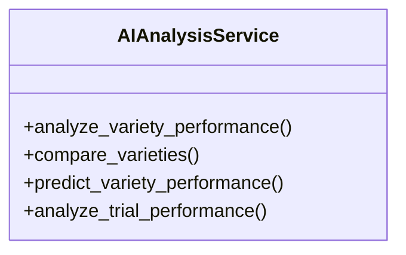

# agricultural_modules.agricultural_experiments.services.ai_analysis_service

## Imports
- datetime
- decimal
- django.conf
- django.db
- django.db.models
- django.utils
- json
- logging
- models.ai_analysis
- models.experiment
- models.harvest
- models.variety

## Classes
- AIAnalysisService
  - method: `analyze_variety_performance`
  - method: `compare_varieties`
  - method: `predict_variety_performance`
  - method: `analyze_trial_performance`

## Functions
- analyze_variety_performance
- compare_varieties
- predict_variety_performance
- analyze_trial_performance

## Module Variables
- `logger`

## Class Diagram

