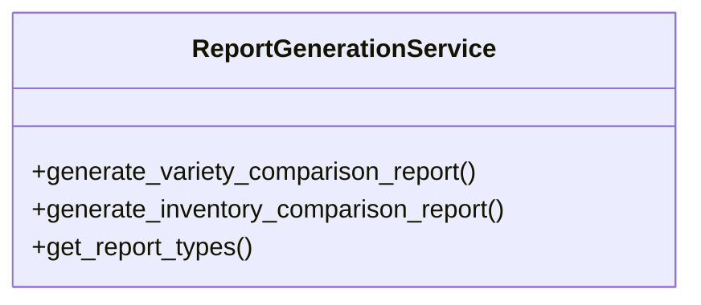

# agricultural_modules.agricultural_experiments.services.report_generation_service

## Imports
- datetime
- decimal
- django.db
- django.db.models
- django.utils
- json
- logging
- models.experiment
- models.external_variety
- models.harvest
- models.variety
- models.variety_comparison_report
- services.variety_comparison_service

## Classes
- ReportGenerationService
  - method: `generate_variety_comparison_report`
  - method: `generate_inventory_comparison_report`
  - method: `get_report_types`

## Functions
- generate_variety_comparison_report
- generate_inventory_comparison_report
- get_report_types

## Module Variables
- `logger`

## Class Diagram

