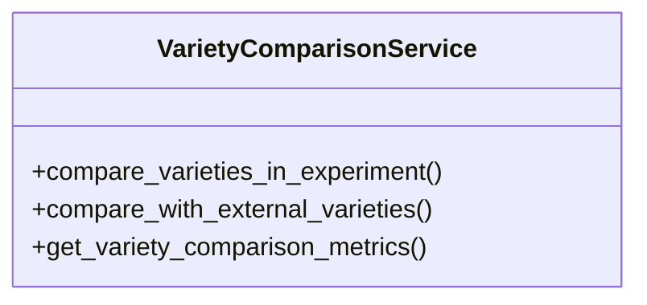

# agricultural_modules.agricultural_experiments.services.variety_comparison_service

## Imports
- datetime
- decimal
- django.db
- django.db.models
- django.utils
- json
- logging
- models.experiment
- models.external_variety
- models.harvest
- models.variety

## Classes
- VarietyComparisonService
  - method: `compare_varieties_in_experiment`
  - method: `compare_with_external_varieties`
  - method: `get_variety_comparison_metrics`

## Functions
- compare_varieties_in_experiment
- compare_with_external_varieties
- get_variety_comparison_metrics

## Module Variables
- `logger`

## Class Diagram

