# agricultural_modules.experiments.admin

## Imports
- django.contrib

## Classes
- LocationAdmin
  - attr: `list_display`
  - attr: `list_filter`
  - attr: `search_fields`
- SeasonAdmin
  - attr: `list_display`
  - attr: `list_filter`
  - attr: `search_fields`
- VarietyTypeAdmin
  - attr: `list_display`
  - attr: `search_fields`
- VarietyAdmin
  - attr: `list_display`
  - attr: `list_filter`
  - attr: `search_fields`
- ExperimentAdmin
  - attr: `list_display`
  - attr: `list_filter`
  - attr: `search_fields`
- ExperimentVarietyAdmin
  - attr: `list_display`
  - attr: `list_filter`
- HarvestAdmin
  - attr: `list_display`
  - attr: `list_filter`
- HarvestQualityGradeAdmin
  - attr: `list_display`
  - attr: `list_filter`
- VarietyEvaluationAdmin
  - attr: `list_display`
  - attr: `list_filter`
- FertilizationProgramAdmin
  - attr: `list_display`
  - attr: `search_fields`
- FertilizationApplicationAdmin
  - attr: `list_display`
  - attr: `list_filter`
- PesticideProgramAdmin
  - attr: `list_display`
  - attr: `search_fields`
- PesticideApplicationAdmin
  - attr: `list_display`
  - attr: `list_filter`
- ExperimentCostAdmin
  - attr: `list_display`
  - attr: `list_filter`
- VarietyPriceRecommendationAdmin
  - attr: `list_display`
  - attr: `list_filter`

## Class Diagram

```mermaid
classDiagram
    class LocationAdmin {
        +list_display
        +list_filter
        +search_fields
    }
    class SeasonAdmin {
        +list_display
        +list_filter
        +search_fields
    }
    class VarietyTypeAdmin {
        +list_display
        +search_fields
    }
    class VarietyAdmin {
        +list_display
        +list_filter
        +search_fields
    }
    class ExperimentAdmin {
        +list_display
        +list_filter
        +search_fields
    }
    class ExperimentVarietyAdmin {
        +list_display
        +list_filter
    }
    class HarvestAdmin {
        +list_display
        +list_filter
    }
    class HarvestQualityGradeAdmin {
        +list_display
        +list_filter
    }
    class VarietyEvaluationAdmin {
        +list_display
        +list_filter
    }
    class FertilizationProgramAdmin {
        +list_display
        +search_fields
    }
    class FertilizationApplicationAdmin {
        +list_display
        +list_filter
    }
    class PesticideProgramAdmin {
        +list_display
        +search_fields
    }
    class PesticideApplicationAdmin {
        +list_display
        +list_filter
    }
    class ExperimentCostAdmin {
        +list_display
        +list_filter
    }
    class VarietyPriceRecommendationAdmin {
        +list_display
        +list_filter
    }
```

