# agricultural_modules.experiments.models

## Imports
- agricultural_modules.farms.models
- agricultural_modules.nurseries.models
- django.contrib.auth
- django.core.validators
- django.db
- django.utils
- typing

## Classes
- Location
  - attr: `name`
  - attr: `code`
  - attr: `location_type`
  - attr: `address`
  - attr: `coordinates`
  - attr: `area`
  - attr: `nursery_ref`
  - attr: `farm_ref`
  - attr: `farm_plot_ref`
  - attr: `soil_type`
  - attr: `is_active`
  - attr: `notes`
  - attr: `created_at`
  - attr: `updated_at`
  - attr: `created_by`
  - attr: `updated_by`
  - method: `nursery`
  - method: `nursery`
  - method: `farm`
  - method: `farm`
  - method: `farm_plot`
  - method: `farm_plot`
  - method: `__str__`
- Season
  - attr: `SEASON_TYPE_CHOICES`
  - attr: `name`
  - attr: `code`
  - attr: `season_type`
  - attr: `start_date`
  - attr: `end_date`
  - attr: `is_active`
  - attr: `notes`
  - attr: `created_at`
  - attr: `updated_at`
  - attr: `created_by`
  - attr: `updated_by`
  - method: `__str__`
  - method: `is_current`
- VarietyType
  - attr: `name`
  - attr: `code`
  - attr: `scientific_name`
  - attr: `description`
  - attr: `created_at`
  - attr: `updated_at`
  - method: `__str__`
- Variety
  - attr: `VARIETY_STATUS_CHOICES`
  - attr: `name`
  - attr: `code`
  - attr: `lot_number`
  - attr: `variety_type`
  - attr: `is_competitor`
  - attr: `competitor_name`
  - attr: `status`
  - attr: `description`
  - attr: `created_at`
  - attr: `updated_at`
  - attr: `created_by`
  - attr: `updated_by`
  - method: `__str__`
- Experiment
  - attr: `EXPERIMENT_STATUS_CHOICES`
  - attr: `title`
  - attr: `code`
  - attr: `description`
  - attr: `location`
  - attr: `season`
  - attr: `start_date`
  - attr: `end_date`
  - attr: `actual_end_date`
  - attr: `status`
  - attr: `replications`
  - attr: `plot_size`
  - attr: `plants_per_plot`
  - attr: `row_spacing`
  - attr: `plant_spacing`
  - attr: `objectives`
  - attr: `notes`
  - attr: `created_at`
  - attr: `updated_at`
  - attr: `created_by`
  - attr: `updated_by`
  - method: `__str__`
  - method: `duration_days`
  - method: `total_area`
- ExperimentVariety
  - attr: `experiment`
  - attr: `variety`
  - attr: `entry_number`
  - attr: `planting_date`
  - attr: `notes`
  - attr: `created_at`
  - attr: `updated_at`
  - method: `__str__`
- Harvest
  - attr: `experiment_variety`
  - attr: `harvest_number`
  - attr: `harvest_date`
  - attr: `fruit_count`
  - attr: `fruit_weight`
  - attr: `notes`
  - attr: `created_at`
  - attr: `updated_at`
  - attr: `created_by`
  - method: `__str__`
  - method: `average_fruit_weight`
- HarvestQualityGrade
  - attr: `QUALITY_GRADE_CHOICES`
  - attr: `harvest`
  - attr: `grade`
  - attr: `fruit_count`
  - attr: `fruit_weight`
  - attr: `created_at`
  - attr: `updated_at`
  - method: `__str__`
- VarietyEvaluation
  - attr: `experiment_variety`
  - attr: `evaluation_date`
  - attr: `fruit_length`
  - attr: `fruit_shape_regularity`
  - attr: `fruit_deformity_rate`
  - attr: `fruit_firmness`
  - attr: `fruit_color`
  - attr: `storage_ability`
  - attr: `transport_ability`
  - attr: `earliness`
  - attr: `leaf_shape`
  - attr: `fruit_coverage`
  - attr: `fungal_resistance`
  - attr: `bacterial_resistance`
  - attr: `insect_resistance`
  - attr: `viral_resistance`
  - attr: `cold_tolerance`
  - attr: `heat_tolerance`
  - attr: `soil_salinity_tolerance`
  - attr: `water_salinity_tolerance`
  - attr: `drought_tolerance`
  - attr: `strengths`
  - attr: `weaknesses`
  - attr: `notes`
  - attr: `created_at`
  - attr: `updated_at`
  - attr: `created_by`
  - attr: `updated_by`
  - method: `__str__`
  - method: `fruit_quality_score`
  - method: `plant_quality_score`
  - method: `disease_resistance_score`
  - method: `environmental_tolerance_score`
  - method: `overall_score`
- FertilizationProgram
  - attr: `experiment`
  - attr: `name`
  - attr: `description`
  - attr: `created_at`
  - attr: `updated_at`
  - attr: `created_by`
  - method: `__str__`
- FertilizationApplication
  - attr: `program`
  - attr: `application_date`
  - attr: `fertilizer_name`
  - attr: `fertilizer_type`
  - attr: `quantity`
  - attr: `unit`
  - attr: `application_method`
  - attr: `cost`
  - attr: `notes`
  - attr: `created_at`
  - attr: `updated_at`
  - method: `__str__`
- PesticideProgram
  - attr: `experiment`
  - attr: `name`
  - attr: `description`
  - attr: `created_at`
  - attr: `updated_at`
  - attr: `created_by`
  - method: `__str__`
- PesticideApplication
  - attr: `program`
  - attr: `application_date`
  - attr: `pesticide_name`
  - attr: `pesticide_type`
  - attr: `target_pest`
  - attr: `quantity`
  - attr: `unit`
  - attr: `application_method`
  - attr: `cost`
  - attr: `notes`
  - attr: `created_at`
  - attr: `updated_at`
  - method: `__str__`
- ExperimentCost
  - attr: `COST_TYPE_CHOICES`
  - attr: `experiment`
  - attr: `cost_type`
  - attr: `description`
  - attr: `amount`
  - attr: `date_incurred`
  - attr: `notes`
  - attr: `created_at`
  - attr: `updated_at`
  - attr: `created_by`
  - method: `__str__`
- VarietyPriceRecommendation
  - attr: `variety`
  - attr: `experiment`
  - attr: `competitor_price`
  - attr: `recommended_price`
  - attr: `justification`
  - attr: `created_at`
  - attr: `updated_at`
  - attr: `created_by`
  - attr: `updated_by`
  - method: `__str__`
- Meta
  - attr: `verbose_name`
  - attr: `verbose_name_plural`
  - attr: `ordering`
- Meta
  - attr: `verbose_name`
  - attr: `verbose_name_plural`
  - attr: `ordering`
- Meta
  - attr: `verbose_name`
  - attr: `verbose_name_plural`
  - attr: `ordering`
- Meta
  - attr: `verbose_name`
  - attr: `verbose_name_plural`
  - attr: `ordering`
- Meta
  - attr: `verbose_name`
  - attr: `verbose_name_plural`
  - attr: `ordering`
- Meta
  - attr: `verbose_name`
  - attr: `verbose_name_plural`
  - attr: `ordering`
  - attr: `unique_together`
- Meta
  - attr: `verbose_name`
  - attr: `verbose_name_plural`
  - attr: `ordering`
  - attr: `unique_together`
- Meta
  - attr: `verbose_name`
  - attr: `verbose_name_plural`
  - attr: `ordering`
  - attr: `unique_together`
- Meta
  - attr: `verbose_name`
  - attr: `verbose_name_plural`
  - attr: `ordering`
- Meta
  - attr: `verbose_name`
  - attr: `verbose_name_plural`
  - attr: `ordering`
- Meta
  - attr: `verbose_name`
  - attr: `verbose_name_plural`
  - attr: `ordering`
- Meta
  - attr: `verbose_name`
  - attr: `verbose_name_plural`
  - attr: `ordering`
- Meta
  - attr: `verbose_name`
  - attr: `verbose_name_plural`
  - attr: `ordering`
- Meta
  - attr: `verbose_name`
  - attr: `verbose_name_plural`
  - attr: `ordering`
- Meta
  - attr: `verbose_name`
  - attr: `verbose_name_plural`
  - attr: `ordering`
  - attr: `unique_together`

## Functions
- nursery
- nursery
- farm
- farm
- farm_plot
- farm_plot
- __str__
- __str__
- is_current
- __str__
- __str__
- __str__
- duration_days
- total_area
- __str__
- __str__
- average_fruit_weight
- __str__
- __str__
- fruit_quality_score
- plant_quality_score
- disease_resistance_score
- environmental_tolerance_score
- overall_score
- __str__
- __str__
- __str__
- __str__
- __str__
- __str__

## Module Variables
- `User`
- `_LOCATION_NURSERY_OVERRIDES`
- `_LOCATION_FARM_OVERRIDES`
- `_LOCATION_PLOT_OVERRIDES`

## Class Diagram

```mermaid
classDiagram
    class Location {
        +name
        +code
        +location_type
        +address
        +coordinates
        +... (11 more)
        +nursery()
        +nursery()
        +farm()
        +farm()
        +farm_plot()
        +... (2 more)
    }
    class Season {
        +SEASON_TYPE_CHOICES
        +name
        +code
        +season_type
        +start_date
        +... (7 more)
        +__str__()
        +is_current()
    }
    class VarietyType {
        +name
        +code
        +scientific_name
        +description
        +created_at
        +... (1 more)
        +__str__()
    }
    class Variety {
        +VARIETY_STATUS_CHOICES
        +name
        +code
        +lot_number
        +variety_type
        +... (8 more)
        +__str__()
    }
    class Experiment {
        +EXPERIMENT_STATUS_CHOICES
        +title
        +code
        +description
        +location
        +... (16 more)
        +__str__()
        +duration_days()
        +total_area()
    }
    class ExperimentVariety {
        +experiment
        +variety
        +entry_number
        +planting_date
        +notes
        +... (2 more)
        +__str__()
    }
    class Harvest {
        +experiment_variety
        +harvest_number
        +harvest_date
        +fruit_count
        +fruit_weight
        +... (4 more)
        +__str__()
        +average_fruit_weight()
    }
    class HarvestQualityGrade {
        +QUALITY_GRADE_CHOICES
        +harvest
        +grade
        +fruit_count
        +fruit_weight
        +... (2 more)
        +__str__()
    }
    class VarietyEvaluation {
        +experiment_variety
        +evaluation_date
        +fruit_length
        +fruit_shape_regularity
        +fruit_deformity_rate
        +... (23 more)
        +__str__()
        +fruit_quality_score()
        +plant_quality_score()
        +disease_resistance_score()
        +environmental_tolerance_score()
        +... (1 more)
    }
    class FertilizationProgram {
        +experiment
        +name
        +description
        +created_at
        +updated_at
        +... (1 more)
        +__str__()
    }
    class FertilizationApplication {
        +program
        +application_date
        +fertilizer_name
        +fertilizer_type
        +quantity
        +... (6 more)
        +__str__()
    }
    class PesticideProgram {
        +experiment
        +name
        +description
        +created_at
        +updated_at
        +... (1 more)
        +__str__()
    }
    class PesticideApplication {
        +program
        +application_date
        +pesticide_name
        +pesticide_type
        +target_pest
        +... (7 more)
        +__str__()
    }
    class ExperimentCost {
        +COST_TYPE_CHOICES
        +experiment
        +cost_type
        +description
        +amount
        +... (5 more)
        +__str__()
    }
    class VarietyPriceRecommendation {
        +variety
        +experiment
        +competitor_price
        +recommended_price
        +justification
        +... (4 more)
        +__str__()
    }
    class Meta {
        +verbose_name
        +verbose_name_plural
        +ordering
    }
    class Meta {
        +verbose_name
        +verbose_name_plural
        +ordering
    }
    class Meta {
        +verbose_name
        +verbose_name_plural
        +ordering
    }
    class Meta {
        +verbose_name
        +verbose_name_plural
        +ordering
    }
    class Meta {
        +verbose_name
        +verbose_name_plural
        +ordering
    }
    class Meta {
        +verbose_name
        +verbose_name_plural
        +ordering
        +unique_together
    }
    class Meta {
        +verbose_name
        +verbose_name_plural
        +ordering
        +unique_together
    }
    class Meta {
        +verbose_name
        +verbose_name_plural
        +ordering
        +unique_together
    }
    class Meta {
        +verbose_name
        +verbose_name_plural
        +ordering
    }
    class Meta {
        +verbose_name
        +verbose_name_plural
        +ordering
    }
    class Meta {
        +verbose_name
        +verbose_name_plural
        +ordering
    }
    class Meta {
        +verbose_name
        +verbose_name_plural
        +ordering
    }
    class Meta {
        +verbose_name
        +verbose_name_plural
        +ordering
    }
    class Meta {
        +verbose_name
        +verbose_name_plural
        +ordering
    }
    class Meta {
        +verbose_name
        +verbose_name_plural
        +ordering
        +unique_together
    }
    Location --> Meta
    Location --> Meta
    Location --> Meta
    Location --> Meta
    Location --> Meta
    Location --> Meta
    Location --> Meta
    Location --> Meta
    Location --> Meta
    Location --> Meta
    Location --> Meta
    Location --> Meta
    Location --> Meta
    Location --> Meta
    Location --> Meta
    Season --> Meta
    Season --> Meta
    Season --> Meta
    Season --> Meta
    Season --> Meta
    Season --> Meta
    Season --> Meta
    Season --> Meta
    Season --> Meta
    Season --> Meta
    Season --> Meta
    Season --> Meta
    Season --> Meta
    Season --> Meta
    Season --> Meta
    VarietyType --> Meta
    VarietyType --> Meta
    VarietyType --> Meta
    VarietyType --> Meta
    VarietyType --> Meta
    VarietyType --> Meta
    VarietyType --> Meta
    VarietyType --> Meta
    VarietyType --> Meta
    VarietyType --> Meta
    VarietyType --> Meta
    VarietyType --> Meta
    VarietyType --> Meta
    VarietyType --> Meta
    VarietyType --> Meta
    Variety --> Meta
    Variety --> Meta
    Variety --> Meta
    Variety --> Meta
    Variety --> Meta
    Variety --> Meta
    Variety --> Meta
    Variety --> Meta
    Variety --> Meta
    Variety --> Meta
    Variety --> Meta
    Variety --> Meta
    Variety --> Meta
    Variety --> Meta
    Variety --> Meta
    Experiment --> Meta
    Experiment --> Meta
    Experiment --> Meta
    Experiment --> Meta
    Experiment --> Meta
    Experiment --> Meta
    Experiment --> Meta
    Experiment --> Meta
    Experiment --> Meta
    Experiment --> Meta
    Experiment --> Meta
    Experiment --> Meta
    Experiment --> Meta
    Experiment --> Meta
    Experiment --> Meta
    ExperimentVariety --> Meta
    ExperimentVariety --> Meta
    ExperimentVariety --> Meta
    ExperimentVariety --> Meta
    ExperimentVariety --> Meta
    ExperimentVariety --> Meta
    ExperimentVariety --> Meta
    ExperimentVariety --> Meta
    ExperimentVariety --> Meta
    ExperimentVariety --> Meta
    ExperimentVariety --> Meta
    ExperimentVariety --> Meta
    ExperimentVariety --> Meta
    ExperimentVariety --> Meta
    ExperimentVariety --> Meta
    Harvest --> Meta
    Harvest --> Meta
    Harvest --> Meta
    Harvest --> Meta
    Harvest --> Meta
    Harvest --> Meta
    Harvest --> Meta
    Harvest --> Meta
    Harvest --> Meta
    Harvest --> Meta
    Harvest --> Meta
    Harvest --> Meta
    Harvest --> Meta
    Harvest --> Meta
    Harvest --> Meta
    HarvestQualityGrade --> Meta
    HarvestQualityGrade --> Meta
    HarvestQualityGrade --> Meta
    HarvestQualityGrade --> Meta
    HarvestQualityGrade --> Meta
    HarvestQualityGrade --> Meta
    HarvestQualityGrade --> Meta
    HarvestQualityGrade --> Meta
    HarvestQualityGrade --> Meta
    HarvestQualityGrade --> Meta
    HarvestQualityGrade --> Meta
    HarvestQualityGrade --> Meta
    HarvestQualityGrade --> Meta
    HarvestQualityGrade --> Meta
    HarvestQualityGrade --> Meta
    VarietyEvaluation --> Meta
    VarietyEvaluation --> Meta
    VarietyEvaluation --> Meta
    VarietyEvaluation --> Meta
    VarietyEvaluation --> Meta
    VarietyEvaluation --> Meta
    VarietyEvaluation --> Meta
    VarietyEvaluation --> Meta
    VarietyEvaluation --> Meta
    VarietyEvaluation --> Meta
    VarietyEvaluation --> Meta
    VarietyEvaluation --> Meta
    VarietyEvaluation --> Meta
    VarietyEvaluation --> Meta
    VarietyEvaluation --> Meta
    FertilizationProgram --> Meta
    FertilizationProgram --> Meta
    FertilizationProgram --> Meta
    FertilizationProgram --> Meta
    FertilizationProgram --> Meta
    FertilizationProgram --> Meta
    FertilizationProgram --> Meta
    FertilizationProgram --> Meta
    FertilizationProgram --> Meta
    FertilizationProgram --> Meta
    FertilizationProgram --> Meta
    FertilizationProgram --> Meta
    FertilizationProgram --> Meta
    FertilizationProgram --> Meta
    FertilizationProgram --> Meta
    FertilizationApplication --> Meta
    FertilizationApplication --> Meta
    FertilizationApplication --> Meta
    FertilizationApplication --> Meta
    FertilizationApplication --> Meta
    FertilizationApplication --> Meta
    FertilizationApplication --> Meta
    FertilizationApplication --> Meta
    FertilizationApplication --> Meta
    FertilizationApplication --> Meta
    FertilizationApplication --> Meta
    FertilizationApplication --> Meta
    FertilizationApplication --> Meta
    FertilizationApplication --> Meta
    FertilizationApplication --> Meta
    PesticideProgram --> Meta
    PesticideProgram --> Meta
    PesticideProgram --> Meta
    PesticideProgram --> Meta
    PesticideProgram --> Meta
    PesticideProgram --> Meta
    PesticideProgram --> Meta
    PesticideProgram --> Meta
    PesticideProgram --> Meta
    PesticideProgram --> Meta
    PesticideProgram --> Meta
    PesticideProgram --> Meta
    PesticideProgram --> Meta
    PesticideProgram --> Meta
    PesticideProgram --> Meta
    PesticideApplication --> Meta
    PesticideApplication --> Meta
    PesticideApplication --> Meta
    PesticideApplication --> Meta
    PesticideApplication --> Meta
    PesticideApplication --> Meta
    PesticideApplication --> Meta
    PesticideApplication --> Meta
    PesticideApplication --> Meta
    PesticideApplication --> Meta
    PesticideApplication --> Meta
    PesticideApplication --> Meta
    PesticideApplication --> Meta
    PesticideApplication --> Meta
    PesticideApplication --> Meta
    ExperimentCost --> Meta
    ExperimentCost --> Meta
    ExperimentCost --> Meta
    ExperimentCost --> Meta
    ExperimentCost --> Meta
    ExperimentCost --> Meta
    ExperimentCost --> Meta
    ExperimentCost --> Meta
    ExperimentCost --> Meta
    ExperimentCost --> Meta
    ExperimentCost --> Meta
    ExperimentCost --> Meta
    ExperimentCost --> Meta
    ExperimentCost --> Meta
    ExperimentCost --> Meta
    VarietyPriceRecommendation --> Meta
    VarietyPriceRecommendation --> Meta
    VarietyPriceRecommendation --> Meta
    VarietyPriceRecommendation --> Meta
    VarietyPriceRecommendation --> Meta
    VarietyPriceRecommendation --> Meta
    VarietyPriceRecommendation --> Meta
    VarietyPriceRecommendation --> Meta
    VarietyPriceRecommendation --> Meta
    VarietyPriceRecommendation --> Meta
    VarietyPriceRecommendation --> Meta
    VarietyPriceRecommendation --> Meta
    VarietyPriceRecommendation --> Meta
    VarietyPriceRecommendation --> Meta
    VarietyPriceRecommendation --> Meta
```

