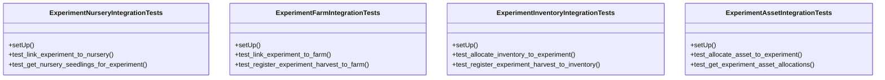

# agricultural_modules.experiments.tests.test_integration

## Imports
- datetime
- decimal
- django.contrib.auth
- django.test
- django.utils
- integration
- models
- unittest
- unittest.mock

## Classes
- ExperimentNurseryIntegrationTests
  - method: `setUp`
  - method: `test_link_experiment_to_nursery`
  - method: `test_get_nursery_seedlings_for_experiment`
- ExperimentFarmIntegrationTests
  - method: `setUp`
  - method: `test_link_experiment_to_farm`
  - method: `test_register_experiment_harvest_to_farm`
- ExperimentInventoryIntegrationTests
  - method: `setUp`
  - method: `test_allocate_inventory_to_experiment`
  - method: `test_register_experiment_harvest_to_inventory`
- ExperimentAssetIntegrationTests
  - method: `setUp`
  - method: `test_allocate_asset_to_experiment`
  - method: `test_get_experiment_asset_allocations`

## Functions
- setUp
- test_link_experiment_to_nursery
- test_get_nursery_seedlings_for_experiment
- setUp
- test_link_experiment_to_farm
- test_register_experiment_harvest_to_farm
- setUp
- test_allocate_inventory_to_experiment
- test_register_experiment_harvest_to_inventory
- setUp
- test_allocate_asset_to_experiment
- test_get_experiment_asset_allocations

## Module Variables
- `User`

## Class Diagram

