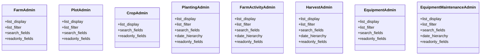

# agricultural_modules.farms.admin

## Imports
- django.contrib
- models

## Classes
- FarmAdmin
  - attr: `list_display`
  - attr: `list_filter`
  - attr: `search_fields`
  - attr: `readonly_fields`
- PlotAdmin
  - attr: `list_display`
  - attr: `list_filter`
  - attr: `search_fields`
  - attr: `readonly_fields`
- CropAdmin
  - attr: `list_display`
  - attr: `search_fields`
  - attr: `readonly_fields`
- PlantingAdmin
  - attr: `list_display`
  - attr: `list_filter`
  - attr: `search_fields`
  - attr: `date_hierarchy`
  - attr: `readonly_fields`
- FarmActivityAdmin
  - attr: `list_display`
  - attr: `list_filter`
  - attr: `search_fields`
  - attr: `date_hierarchy`
  - attr: `readonly_fields`
- HarvestAdmin
  - attr: `list_display`
  - attr: `list_filter`
  - attr: `search_fields`
  - attr: `date_hierarchy`
  - attr: `readonly_fields`
- EquipmentAdmin
  - attr: `list_display`
  - attr: `list_filter`
  - attr: `search_fields`
  - attr: `readonly_fields`
- EquipmentMaintenanceAdmin
  - attr: `list_display`
  - attr: `list_filter`
  - attr: `search_fields`
  - attr: `date_hierarchy`
  - attr: `readonly_fields`

## Class Diagram

