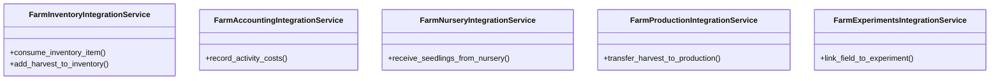

# agricultural_modules.farms.integration

## Imports
- models
- services

## Classes
- FarmInventoryIntegrationService
  - method: `consume_inventory_item`
  - method: `add_harvest_to_inventory`
- FarmAccountingIntegrationService
  - method: `record_activity_costs`
- FarmNurseryIntegrationService
  - method: `receive_seedlings_from_nursery`
- FarmProductionIntegrationService
  - method: `transfer_harvest_to_production`
- FarmExperimentsIntegrationService
  - method: `link_field_to_experiment`

## Functions
- consume_inventory_item
- add_harvest_to_inventory
- record_activity_costs
- receive_seedlings_from_nursery
- transfer_harvest_to_production
- link_field_to_experiment

## Class Diagram

