# agricultural_modules.farms.models

## Imports
- django.conf
- django.db
- django.utils.translation
- mptt.models

## Classes
- Farm
  - attr: `name`
  - attr: `code`
  - attr: `location`
  - attr: `gps_coordinates`
  - attr: `total_area`
  - attr: `cultivated_area`
  - attr: `farm_type`
  - attr: `description`
  - attr: `manager`
  - attr: `establishment_date`
  - attr: `is_active`
  - attr: `created_at`
  - attr: `updated_at`
  - method: `__str__`
- FarmSection
  - attr: `farm`
  - attr: `name`
  - attr: `code`
  - attr: `section_type`
  - attr: `area`
  - attr: `description`
  - attr: `is_active`
  - attr: `created_at`
  - attr: `updated_at`
  - method: `__str__`
- Plot
  - attr: `farm_section`
  - attr: `name`
  - attr: `code`
  - attr: `area`
  - attr: `soil_type`
  - attr: `irrigation_type`
  - attr: `description`
  - attr: `is_active`
  - attr: `created_at`
  - attr: `updated_at`
  - method: `__str__`
- FarmPlot
  - attr: `farm`
  - attr: `name`
  - attr: `area`
  - attr: `soil_type`
  - attr: `created_at`
  - attr: `updated_at`
  - method: `__str__`
- Crop
  - attr: `name`
  - attr: `scientific_name`
  - attr: `crop_type`
  - attr: `growing_season`
  - attr: `description`
  - attr: `created_at`
  - attr: `updated_at`
  - method: `__str__`
- CropVariety
  - attr: `crop`
  - attr: `name`
  - attr: `code`
  - attr: `description`
  - attr: `maturity_days`
  - attr: `yield_potential`
  - attr: `disease_resistance`
  - attr: `created_at`
  - attr: `updated_at`
  - method: `__str__`
- Planting
  - attr: `plot`
  - attr: `crop_variety`
  - attr: `planting_date`
  - attr: `expected_harvest_date`
  - attr: `actual_harvest_date`
  - attr: `planting_method`
  - attr: `plant_spacing`
  - attr: `row_spacing`
  - attr: `seed_rate`
  - attr: `status`
  - attr: `notes`
  - attr: `created_at`
  - attr: `updated_at`
  - method: `__str__`
- FarmActivity
  - attr: `farm`
  - attr: `planting`
  - attr: `activity_type`
  - attr: `date`
  - attr: `description`
  - attr: `performed_by`
  - attr: `cost`
  - attr: `notes`
  - attr: `created_at`
  - attr: `updated_at`
  - method: `__str__`
- Harvest
  - attr: `planting`
  - attr: `harvest_date`
  - attr: `quantity`
  - attr: `unit`
  - attr: `quality_grade`
  - attr: `notes`
  - attr: `created_at`
  - attr: `updated_at`
  - method: `__str__`
- Equipment
  - attr: `farm`
  - attr: `name`
  - attr: `equipment_type`
  - attr: `model`
  - attr: `serial_number`
  - attr: `purchase_date`
  - attr: `purchase_cost`
  - attr: `status`
  - attr: `notes`
  - attr: `created_at`
  - attr: `updated_at`
  - method: `__str__`
- EquipmentMaintenance
  - attr: `equipment`
  - attr: `maintenance_date`
  - attr: `maintenance_type`
  - attr: `description`
  - attr: `cost`
  - attr: `performed_by`
  - attr: `notes`
  - attr: `created_at`
  - attr: `updated_at`
  - method: `__str__`
- Field
  - attr: `farm`
  - attr: `name`
  - attr: `area`
  - attr: `description`
  - attr: `created_at`
  - attr: `updated_at`
  - method: `__str__`
- PlantingSeason
  - attr: `field`
  - attr: `crop`
  - attr: `start_date`
  - attr: `expected_harvest_date`
  - attr: `actual_harvest_date`
  - attr: `notes`
  - attr: `created_at`
  - attr: `updated_at`
  - method: `__str__`
- AgriculturalActivityType
  - attr: `name`
  - attr: `description`
  - method: `__str__`
- AgriculturalActivity
  - attr: `planting_season`
  - attr: `activity_type`
  - attr: `activity_date`
  - attr: `description`
  - attr: `cost`
  - attr: `created_at`
  - attr: `updated_at`
  - method: `__str__`
- FarmResource
  - attr: `activity`
  - attr: `product_name_temp`
  - attr: `quantity_used`
  - attr: `unit_of_measure`
  - attr: `cost_per_unit`
  - attr: `created_at`
  - attr: `updated_at`
  - method: `__str__`
- FarmWorkerLog
  - attr: `activity`
  - attr: `log_date`
  - attr: `cost`
  - attr: `notes`
- FarmEquipmentLog
  - attr: `activity`
  - attr: `log_date`
  - attr: `cost`
  - attr: `notes`
- Meta
  - attr: `verbose_name`
  - attr: `verbose_name_plural`
  - attr: `ordering`
- Meta
  - attr: `verbose_name`
  - attr: `verbose_name_plural`
  - attr: `unique_together`
  - attr: `ordering`
- Meta
  - attr: `verbose_name`
  - attr: `verbose_name_plural`
  - attr: `unique_together`
- Meta
  - attr: `verbose_name`
  - attr: `verbose_name_plural`
  - attr: `ordering`
- Meta
  - attr: `verbose_name`
  - attr: `verbose_name_plural`
  - attr: `ordering`
- Meta
  - attr: `verbose_name`
  - attr: `verbose_name_plural`
  - attr: `unique_together`
  - attr: `ordering`
- Meta
  - attr: `verbose_name`
  - attr: `verbose_name_plural`
  - attr: `ordering`
- Meta
  - attr: `verbose_name`
  - attr: `verbose_name_plural`
  - attr: `ordering`
- Meta
  - attr: `verbose_name`
  - attr: `verbose_name_plural`
  - attr: `ordering`
- Meta
  - attr: `verbose_name`
  - attr: `verbose_name_plural`
  - attr: `ordering`
- Meta
  - attr: `verbose_name`
  - attr: `verbose_name_plural`
  - attr: `ordering`
- Meta
  - attr: `verbose_name`
  - attr: `verbose_name_plural`
  - attr: `ordering`
- Meta
  - attr: `verbose_name`
  - attr: `verbose_name_plural`
  - attr: `ordering`
- Meta
  - attr: `verbose_name`
  - attr: `verbose_name_plural`
  - attr: `ordering`
- Meta
  - attr: `verbose_name`
  - attr: `verbose_name_plural`
  - attr: `ordering`
- Meta
  - attr: `verbose_name`
  - attr: `verbose_name_plural`
  - attr: `ordering`
- Meta
  - attr: `verbose_name`
  - attr: `verbose_name_plural`
  - attr: `ordering`
- Meta
  - attr: `verbose_name`
  - attr: `verbose_name_plural`
  - attr: `ordering`

## Functions
- __str__
- __str__
- __str__
- __str__
- __str__
- __str__
- __str__
- __str__
- __str__
- __str__
- __str__
- __str__
- __str__
- __str__
- __str__
- __str__

## Class Diagram

```mermaid
classDiagram
    class Farm {
        +name
        +code
        +location
        +gps_coordinates
        +total_area
        +... (8 more)
        +__str__()
    }
    class FarmSection {
        +farm
        +name
        +code
        +section_type
        +area
        +... (4 more)
        +__str__()
    }
    class Plot {
        +farm_section
        +name
        +code
        +area
        +soil_type
        +... (5 more)
        +__str__()
    }
    class FarmPlot {
        +farm
        +name
        +area
        +soil_type
        +created_at
        +... (1 more)
        +__str__()
    }
    class Crop {
        +name
        +scientific_name
        +crop_type
        +growing_season
        +description
        +... (2 more)
        +__str__()
    }
    class CropVariety {
        +crop
        +name
        +code
        +description
        +maturity_days
        +... (4 more)
        +__str__()
    }
    class Planting {
        +plot
        +crop_variety
        +planting_date
        +expected_harvest_date
        +actual_harvest_date
        +... (8 more)
        +__str__()
    }
    class FarmActivity {
        +farm
        +planting
        +activity_type
        +date
        +description
        +... (5 more)
        +__str__()
    }
    class Harvest {
        +planting
        +harvest_date
        +quantity
        +unit
        +quality_grade
        +... (3 more)
        +__str__()
    }
    class Equipment {
        +farm
        +name
        +equipment_type
        +model
        +serial_number
        +... (6 more)
        +__str__()
    }
    class EquipmentMaintenance {
        +equipment
        +maintenance_date
        +maintenance_type
        +description
        +cost
        +... (4 more)
        +__str__()
    }
    class Field {
        +farm
        +name
        +area
        +description
        +created_at
        +... (1 more)
        +__str__()
    }
    class PlantingSeason {
        +field
        +crop
        +start_date
        +expected_harvest_date
        +actual_harvest_date
        +... (3 more)
        +__str__()
    }
    class AgriculturalActivityType {
        +name
        +description
        +__str__()
    }
    class AgriculturalActivity {
        +planting_season
        +activity_type
        +activity_date
        +description
        +cost
        +... (2 more)
        +__str__()
    }
    class FarmResource {
        +activity
        +product_name_temp
        +quantity_used
        +unit_of_measure
        +cost_per_unit
        +... (2 more)
        +__str__()
    }
    class FarmWorkerLog {
        +activity
        +log_date
        +cost
        +notes
    }
    class FarmEquipmentLog {
        +activity
        +log_date
        +cost
        +notes
    }
    class Meta {
        +verbose_name
        +verbose_name_plural
        +ordering
    }
    class Meta {
        +verbose_name
        +verbose_name_plural
        +unique_together
        +ordering
    }
    class Meta {
        +verbose_name
        +verbose_name_plural
        +unique_together
    }
    class Meta {
        +verbose_name
        +verbose_name_plural
        +ordering
    }
    class Meta {
        +verbose_name
        +verbose_name_plural
        +ordering
    }
    class Meta {
        +verbose_name
        +verbose_name_plural
        +unique_together
        +ordering
    }
    class Meta {
        +verbose_name
        +verbose_name_plural
        +ordering
    }
    class Meta {
        +verbose_name
        +verbose_name_plural
        +ordering
    }
    class Meta {
        +verbose_name
        +verbose_name_plural
        +ordering
    }
    class Meta {
        +verbose_name
        +verbose_name_plural
        +ordering
    }
    class Meta {
        +verbose_name
        +verbose_name_plural
        +ordering
    }
    class Meta {
        +verbose_name
        +verbose_name_plural
        +ordering
    }
    class Meta {
        +verbose_name
        +verbose_name_plural
        +ordering
    }
    class Meta {
        +verbose_name
        +verbose_name_plural
        +ordering
    }
    class Meta {
        +verbose_name
        +verbose_name_plural
        +ordering
    }
    class Meta {
        +verbose_name
        +verbose_name_plural
        +ordering
    }
    class Meta {
        +verbose_name
        +verbose_name_plural
        +ordering
    }
    class Meta {
        +verbose_name
        +verbose_name_plural
        +ordering
    }
    Farm --> Meta
    Farm --> Meta
    Farm --> Meta
    Farm --> Meta
    Farm --> Meta
    Farm --> Meta
    Farm --> Meta
    Farm --> Meta
    Farm --> Meta
    Farm --> Meta
    Farm --> Meta
    Farm --> Meta
    Farm --> Meta
    Farm --> Meta
    Farm --> Meta
    Farm --> Meta
    Farm --> Meta
    Farm --> Meta
    FarmSection --> Meta
    FarmSection --> Meta
    FarmSection --> Meta
    FarmSection --> Meta
    FarmSection --> Meta
    FarmSection --> Meta
    FarmSection --> Meta
    FarmSection --> Meta
    FarmSection --> Meta
    FarmSection --> Meta
    FarmSection --> Meta
    FarmSection --> Meta
    FarmSection --> Meta
    FarmSection --> Meta
    FarmSection --> Meta
    FarmSection --> Meta
    FarmSection --> Meta
    FarmSection --> Meta
    Plot --> Meta
    Plot --> Meta
    Plot --> Meta
    Plot --> Meta
    Plot --> Meta
    Plot --> Meta
    Plot --> Meta
    Plot --> Meta
    Plot --> Meta
    Plot --> Meta
    Plot --> Meta
    Plot --> Meta
    Plot --> Meta
    Plot --> Meta
    Plot --> Meta
    Plot --> Meta
    Plot --> Meta
    Plot --> Meta
    FarmPlot --> Meta
    FarmPlot --> Meta
    FarmPlot --> Meta
    FarmPlot --> Meta
    FarmPlot --> Meta
    FarmPlot --> Meta
    FarmPlot --> Meta
    FarmPlot --> Meta
    FarmPlot --> Meta
    FarmPlot --> Meta
    FarmPlot --> Meta
    FarmPlot --> Meta
    FarmPlot --> Meta
    FarmPlot --> Meta
    FarmPlot --> Meta
    FarmPlot --> Meta
    FarmPlot --> Meta
    FarmPlot --> Meta
    Crop --> Meta
    Crop --> Meta
    Crop --> Meta
    Crop --> Meta
    Crop --> Meta
    Crop --> Meta
    Crop --> Meta
    Crop --> Meta
    Crop --> Meta
    Crop --> Meta
    Crop --> Meta
    Crop --> Meta
    Crop --> Meta
    Crop --> Meta
    Crop --> Meta
    Crop --> Meta
    Crop --> Meta
    Crop --> Meta
    CropVariety --> Meta
    CropVariety --> Meta
    CropVariety --> Meta
    CropVariety --> Meta
    CropVariety --> Meta
    CropVariety --> Meta
    CropVariety --> Meta
    CropVariety --> Meta
    CropVariety --> Meta
    CropVariety --> Meta
    CropVariety --> Meta
    CropVariety --> Meta
    CropVariety --> Meta
    CropVariety --> Meta
    CropVariety --> Meta
    CropVariety --> Meta
    CropVariety --> Meta
    CropVariety --> Meta
    Planting --> Meta
    Planting --> Meta
    Planting --> Meta
    Planting --> Meta
    Planting --> Meta
    Planting --> Meta
    Planting --> Meta
    Planting --> Meta
    Planting --> Meta
    Planting --> Meta
    Planting --> Meta
    Planting --> Meta
    Planting --> Meta
    Planting --> Meta
    Planting --> Meta
    Planting --> Meta
    Planting --> Meta
    Planting --> Meta
    FarmActivity --> Meta
    FarmActivity --> Meta
    FarmActivity --> Meta
    FarmActivity --> Meta
    FarmActivity --> Meta
    FarmActivity --> Meta
    FarmActivity --> Meta
    FarmActivity --> Meta
    FarmActivity --> Meta
    FarmActivity --> Meta
    FarmActivity --> Meta
    FarmActivity --> Meta
    FarmActivity --> Meta
    FarmActivity --> Meta
    FarmActivity --> Meta
    FarmActivity --> Meta
    FarmActivity --> Meta
    FarmActivity --> Meta
    Harvest --> Meta
    Harvest --> Meta
    Harvest --> Meta
    Harvest --> Meta
    Harvest --> Meta
    Harvest --> Meta
    Harvest --> Meta
    Harvest --> Meta
    Harvest --> Meta
    Harvest --> Meta
    Harvest --> Meta
    Harvest --> Meta
    Harvest --> Meta
    Harvest --> Meta
    Harvest --> Meta
    Harvest --> Meta
    Harvest --> Meta
    Harvest --> Meta
    Equipment --> Meta
    Equipment --> Meta
    Equipment --> Meta
    Equipment --> Meta
    Equipment --> Meta
    Equipment --> Meta
    Equipment --> Meta
    Equipment --> Meta
    Equipment --> Meta
    Equipment --> Meta
    Equipment --> Meta
    Equipment --> Meta
    Equipment --> Meta
    Equipment --> Meta
    Equipment --> Meta
    Equipment --> Meta
    Equipment --> Meta
    Equipment --> Meta
    EquipmentMaintenance --> Meta
    EquipmentMaintenance --> Meta
    EquipmentMaintenance --> Meta
    EquipmentMaintenance --> Meta
    EquipmentMaintenance --> Meta
    EquipmentMaintenance --> Meta
    EquipmentMaintenance --> Meta
    EquipmentMaintenance --> Meta
    EquipmentMaintenance --> Meta
    EquipmentMaintenance --> Meta
    EquipmentMaintenance --> Meta
    EquipmentMaintenance --> Meta
    EquipmentMaintenance --> Meta
    EquipmentMaintenance --> Meta
    EquipmentMaintenance --> Meta
    EquipmentMaintenance --> Meta
    EquipmentMaintenance --> Meta
    EquipmentMaintenance --> Meta
    Field --> Meta
    Field --> Meta
    Field --> Meta
    Field --> Meta
    Field --> Meta
    Field --> Meta
    Field --> Meta
    Field --> Meta
    Field --> Meta
    Field --> Meta
    Field --> Meta
    Field --> Meta
    Field --> Meta
    Field --> Meta
    Field --> Meta
    Field --> Meta
    Field --> Meta
    Field --> Meta
    PlantingSeason --> Meta
    PlantingSeason --> Meta
    PlantingSeason --> Meta
    PlantingSeason --> Meta
    PlantingSeason --> Meta
    PlantingSeason --> Meta
    PlantingSeason --> Meta
    PlantingSeason --> Meta
    PlantingSeason --> Meta
    PlantingSeason --> Meta
    PlantingSeason --> Meta
    PlantingSeason --> Meta
    PlantingSeason --> Meta
    PlantingSeason --> Meta
    PlantingSeason --> Meta
    PlantingSeason --> Meta
    PlantingSeason --> Meta
    PlantingSeason --> Meta
    AgriculturalActivityType --> Meta
    AgriculturalActivityType --> Meta
    AgriculturalActivityType --> Meta
    AgriculturalActivityType --> Meta
    AgriculturalActivityType --> Meta
    AgriculturalActivityType --> Meta
    AgriculturalActivityType --> Meta
    AgriculturalActivityType --> Meta
    AgriculturalActivityType --> Meta
    AgriculturalActivityType --> Meta
    AgriculturalActivityType --> Meta
    AgriculturalActivityType --> Meta
    AgriculturalActivityType --> Meta
    AgriculturalActivityType --> Meta
    AgriculturalActivityType --> Meta
    AgriculturalActivityType --> Meta
    AgriculturalActivityType --> Meta
    AgriculturalActivityType --> Meta
    AgriculturalActivity --> Meta
    AgriculturalActivity --> Meta
    AgriculturalActivity --> Meta
    AgriculturalActivity --> Meta
    AgriculturalActivity --> Meta
    AgriculturalActivity --> Meta
    AgriculturalActivity --> Meta
    AgriculturalActivity --> Meta
    AgriculturalActivity --> Meta
    AgriculturalActivity --> Meta
    AgriculturalActivity --> Meta
    AgriculturalActivity --> Meta
    AgriculturalActivity --> Meta
    AgriculturalActivity --> Meta
    AgriculturalActivity --> Meta
    AgriculturalActivity --> Meta
    AgriculturalActivity --> Meta
    AgriculturalActivity --> Meta
    FarmResource --> Meta
    FarmResource --> Meta
    FarmResource --> Meta
    FarmResource --> Meta
    FarmResource --> Meta
    FarmResource --> Meta
    FarmResource --> Meta
    FarmResource --> Meta
    FarmResource --> Meta
    FarmResource --> Meta
    FarmResource --> Meta
    FarmResource --> Meta
    FarmResource --> Meta
    FarmResource --> Meta
    FarmResource --> Meta
    FarmResource --> Meta
    FarmResource --> Meta
    FarmResource --> Meta
    FarmWorkerLog --> Meta
    FarmWorkerLog --> Meta
    FarmWorkerLog --> Meta
    FarmWorkerLog --> Meta
    FarmWorkerLog --> Meta
    FarmWorkerLog --> Meta
    FarmWorkerLog --> Meta
    FarmWorkerLog --> Meta
    FarmWorkerLog --> Meta
    FarmWorkerLog --> Meta
    FarmWorkerLog --> Meta
    FarmWorkerLog --> Meta
    FarmWorkerLog --> Meta
    FarmWorkerLog --> Meta
    FarmWorkerLog --> Meta
    FarmWorkerLog --> Meta
    FarmWorkerLog --> Meta
    FarmWorkerLog --> Meta
    FarmEquipmentLog --> Meta
    FarmEquipmentLog --> Meta
    FarmEquipmentLog --> Meta
    FarmEquipmentLog --> Meta
    FarmEquipmentLog --> Meta
    FarmEquipmentLog --> Meta
    FarmEquipmentLog --> Meta
    FarmEquipmentLog --> Meta
    FarmEquipmentLog --> Meta
    FarmEquipmentLog --> Meta
    FarmEquipmentLog --> Meta
    FarmEquipmentLog --> Meta
    FarmEquipmentLog --> Meta
    FarmEquipmentLog --> Meta
    FarmEquipmentLog --> Meta
    FarmEquipmentLog --> Meta
    FarmEquipmentLog --> Meta
    FarmEquipmentLog --> Meta
```

