# agricultural_modules.farms.services

## Imports
- datetime
- models
- uuid

## Classes
- FarmService
  - method: `create_farm`
  - method: `get_farm_by_id`
  - method: `get_all_farms`
  - method: `update_farm`
  - method: `delete_farm`
- FieldService
  - method: `create_field`
  - method: `get_fields_for_farm`
- CropService
  - method: `create_crop`
- PlantingSeasonService
  - method: `create_planting_season`
- AgriculturalActivityTypeService
  - method: `create_activity_type`
- AgriculturalActivityService
  - method: `create_activity`
- HarvestService
  - method: `create_harvest`
- FarmResourceService
  - method: `add_resource_to_activity`
- FarmWorkerLogService
  - method: `log_worker_activity`
- FarmEquipmentLogService
  - method: `log_equipment_usage`

## Functions
- create_farm
- get_farm_by_id
- get_all_farms
- update_farm
- delete_farm
- create_field
- get_fields_for_farm
- create_crop
- create_planting_season
- create_activity_type
- create_activity
- create_harvest
- add_resource_to_activity
- log_worker_activity
- log_equipment_usage

## Class Diagram

```mermaid
classDiagram
    class FarmService {
        +create_farm()
        +get_farm_by_id()
        +get_all_farms()
        +update_farm()
        +delete_farm()
    }
    class FieldService {
        +create_field()
        +get_fields_for_farm()
    }
    class CropService {
        +create_crop()
    }
    class PlantingSeasonService {
        +create_planting_season()
    }
    class AgriculturalActivityTypeService {
        +create_activity_type()
    }
    class AgriculturalActivityService {
        +create_activity()
    }
    class HarvestService {
        +create_harvest()
    }
    class FarmResourceService {
        +add_resource_to_activity()
    }
    class FarmWorkerLogService {
        +log_worker_activity()
    }
    class FarmEquipmentLogService {
        +log_equipment_usage()
    }
```

