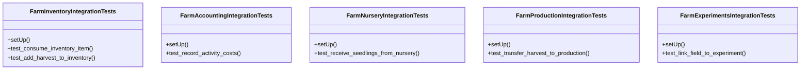

# agricultural_modules.farms.tests.test_integration

## Imports
- django.contrib.auth.models
- django.test
- integration
- models
- services
- unittest.mock

## Classes
- FarmInventoryIntegrationTests
  - method: `setUp`
  - method: `test_consume_inventory_item`
  - method: `test_add_harvest_to_inventory`
- FarmAccountingIntegrationTests
  - method: `setUp`
  - method: `test_record_activity_costs`
- FarmNurseryIntegrationTests
  - method: `setUp`
  - method: `test_receive_seedlings_from_nursery`
- FarmProductionIntegrationTests
  - method: `setUp`
  - method: `test_transfer_harvest_to_production`
- FarmExperimentsIntegrationTests
  - method: `setUp`
  - method: `test_link_field_to_experiment`

## Functions
- setUp
- test_consume_inventory_item
- test_add_harvest_to_inventory
- setUp
- test_record_activity_costs
- setUp
- test_receive_seedlings_from_nursery
- setUp
- test_transfer_harvest_to_production
- setUp
- test_link_field_to_experiment

## Class Diagram

