# agricultural_modules.farms.tests.test_models

## Imports
- django.contrib.auth.models
- django.test
- models

## Classes
- FarmModelTest
  - method: `setUp`
  - method: `test_farm_creation`
- FieldModelTest
  - method: `setUp`
  - method: `test_field_creation`
- CropModelTest
  - method: `setUp`
  - method: `test_crop_creation`
- PlantingSeasonModelTest
  - method: `setUp`
  - method: `test_planting_season_creation`
- AgriculturalActivityTypeModelTest
  - method: `setUp`
  - method: `test_activity_type_creation`
- AgriculturalActivityModelTest
  - method: `setUp`
  - method: `test_activity_creation`
- HarvestModelTest
  - method: `setUp`
  - method: `test_harvest_creation`
- FarmResourceModelTest
  - method: `setUp`
  - method: `test_farm_resource_creation`

## Functions
- setUp
- test_farm_creation
- setUp
- test_field_creation
- setUp
- test_crop_creation
- setUp
- test_planting_season_creation
- setUp
- test_activity_type_creation
- setUp
- test_activity_creation
- setUp
- test_harvest_creation
- setUp
- test_farm_resource_creation

## Class Diagram

```mermaid
classDiagram
    class FarmModelTest {
        +setUp()
        +test_farm_creation()
    }
    class FieldModelTest {
        +setUp()
        +test_field_creation()
    }
    class CropModelTest {
        +setUp()
        +test_crop_creation()
    }
    class PlantingSeasonModelTest {
        +setUp()
        +test_planting_season_creation()
    }
    class AgriculturalActivityTypeModelTest {
        +setUp()
        +test_activity_type_creation()
    }
    class AgriculturalActivityModelTest {
        +setUp()
        +test_activity_creation()
    }
    class HarvestModelTest {
        +setUp()
        +test_harvest_creation()
    }
    class FarmResourceModelTest {
        +setUp()
        +test_farm_resource_creation()
    }
```

