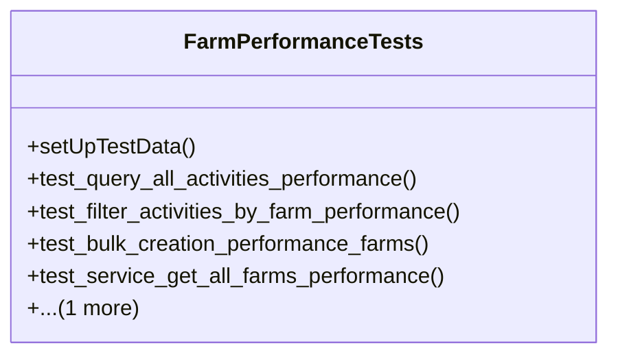

# agricultural_modules.farms.tests.test_performance

## Imports
- django.contrib.auth.models
- django.db
- django.db.models
- django.test
- models
- services
- time

## Classes
- FarmPerformanceTests
  - method: `setUpTestData`
  - method: `test_query_all_activities_performance`
  - method: `test_filter_activities_by_farm_performance`
  - method: `test_bulk_creation_performance_farms`
  - method: `test_service_get_all_farms_performance`
  - method: `test_api_endpoint_performance_placeholder`

## Functions
- setUpTestData
- test_query_all_activities_performance
- test_filter_activities_by_farm_performance
- test_bulk_creation_performance_farms
- test_service_get_all_farms_performance
- test_api_endpoint_performance_placeholder

## Module Variables
- `NUM_FARMS_PERF`
- `NUM_FIELDS_PER_FARM_PERF`
- `NUM_SEASONS_PER_FIELD_PERF`
- `NUM_ACTIVITIES_PER_SEASON_PERF`

## Class Diagram

